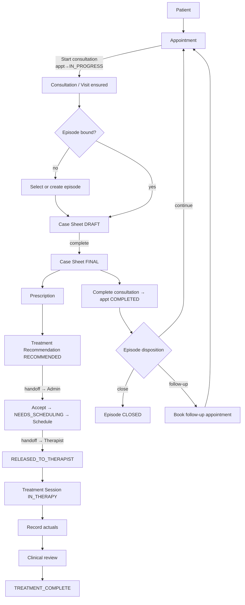

# R7 — Clinical Operating System · Wireframes

> **Authority:** [R7-OWNER-RATIFICATION.md](R7-OWNER-RATIFICATION.md) (8 decisions ratified 2026-07-17).

> ## ⚠ REVISED BY DESIGN REVIEW — read [R7-DESIGN-REVIEW-GAPS.md](R7-DESIGN-REVIEW-GAPS.md) first
> The original W1 **opened directly into `CaseSheetModule` sections** — form-first, not an operating system (A-1). Revised:
> - **W0 Visit Command Center** added as the true landing state (briefing before forms).
> - **Workflow pills** replace circles: 🟢 completed · 🟡 current · ⚪ pending · 🔵 waiting-on-role (**with role marker**) · ⚫ not-applicable (A-11).
> - **Mobile-first** recomposition (A-10): sticky next action, horizontal pills, one primary task.
> - **Clinic-type variants** added (GP/Ayurveda/Physio assemble different journeys — A-4); therapy pills are **capability-gated**, not specialty-gated (E-3).
> - **Patient-safety surfacing** — **CORRECTED, see F-2**: the first revision of W0 displayed `⚠ ALLERGY: Sulfa` and `⚠ eGFR 54`. **Both were fabricated — allergies do not exist in the backend** (`grep -rn "allerg" app/ -il` → empty) and renal indicators are not modelled. Those panels are **removed**; R7 surfaces only verified-existing signals (pending clinical review, Rx status, sessions, episode, billing). Allergy/interaction/renal → **R8 after data modelling**. Authority: [R7-OWNER-RATIFICATION.md](R7-OWNER-RATIFICATION.md).
> - Prescription frames corrected to `DRAFT→FINAL→SIGNED` (E-1); case sheet frames corrected to per-Episode + append-only visit notes (E-2); **billing frames added** (E-4).

**Status:** Discovery — mandatory architecture/implementation input, not approved, not built.
Every wireframe is traceable to verified current components (named in the wireframe-to-code map, §Mapping). These are repository-native ASCII + Mermaid, reviewable without external tools.

---

## W0 · Visit Command Center — **the landing state** (desktop/tablet)

```
┌────────────────────────────────────────────────────────────────────────┐
│ ← Ravi Kumar · 34M · #10482                             [Timeline] [⋮] │
│ WHY TODAY  Follow-up · "back pain worse after travel"                   │  ← purpose + concern
│ Episode: Low back pain · ACTIVE · visit 3        Appt 10:00 IN_PROGRESS │
├────────────────────────────────────────────────────────────────────────┤
│ WHAT CHANGED SINCE 12 JUN        (R7 = verified-existing data only)     │
│  • Therapy Plan A: 4/8 sessions done · last 10 Jun                      │
│  • Prescription: SIGNED 12 Jun (active)                                 │
│  • Billing: 2 services unbilled                                         │
│  [R8] measurement trends (HbA1c/creatinine) — NOT in R7 (no lab model)  │  ← honest boundary
├────────────────────────────────────────────────────────────────────────┤
│ BEFORE YOU ACT                                                          │
│  ⏳ Plan A awaiting YOUR clinical review                                 │  ← verified: NEEDS_CLINICAL_REVIEW
│  [R8] allergy / interaction / renal panels — NOT AVAILABLE (see F-2)    │  ← must NOT fabricate
├────────────────────────────────────────────────────────────────────────┤
│ 🟢 Consult  🟢 Case Sheet  🟡 Rx  ⚪ Recommend  🔵 Sched·A  ⚫ —         │  ← assembled pills
├────────────────────────────────────────────────────────────────────────┤
│ ▸ RECOMMENDED NEXT:  Review therapy outcome (Plan A)                     │
│   why: 4 sessions complete, review milestone reached                     │
│   [ Do this ]   [ Something else ▾ ]                                     │  ← recommends, never dictates
├────────────────────────────────────────────────────────────────────────┤
│ Billing: 2 services unbilled · outstanding ₹1,200        [view]          │  ← doctor read-only
└────────────────────────────────────────────────────────────────────────┘
```
Forms open **from** here (recommendation or pill) — never as the landing state.

## W0-m · Mobile-first Command Center

```
┌───────────────────┐
│ ← Ravi K · 34M  ⋮ │
│ ⏳ Review pending  │   verified safety signal (R7); allergies = R8 (F-2)
├───────────────────┤
│ WHY: follow-up    │
│ "back pain worse" │
├───────────────────┤
│ CHANGED: 4/8 sess │
│ Rx SIGNED · ₹1200 │
├───────────────────┤
│ 🟢🟢🟡⚪🔵⚫       │   horizontal pills, swipeable
├───────────────────┤
│  [one task body]  │   ONE primary task, minimal scroll
│                   │
├───────────────────┤
│ ▸ Review therapy  │   STICKY next action (≥44pt)
│ [Do] [Else ▾]     │
└───────────────────┘
```

## W0-c · Clinic-type variants (same engine, assembled — A-4)

```
GP        : 🟡 Consult  ⚪ Clinical update  ⚪ Rx  ⚪ Billing  ⚪ Complete
            (no therapy pills — lacks appointments.multiday capability, NOT "not Ayurveda")
Ayurveda  : 🟢 Consult 🟢 Update 🟡 Rx ⚪ Recommend ⚪ Plan 🔵 Sched·A ⚪ Sheet ⚪ Sessions ⚪ Billing ⚪ Follow-up
Physio    : 🟢 Consult 🟡 Assessment ⚪ Therapy plan 🔵 Sched·A ⚪ Sheet ⚪ Sessions ⚪ Billing ⚪ Review
            (physio HAS therapy pills — capability seeded for ("ayurveda","physio"))
```

## W-billing · Billing stage (E-4)

```
Doctor view (read-only)          │  Admin view (actionable)
 Consultation      ₹500  unbilled│   [ Create invoice ]  [ Record payment ]
 Abhyanga x4     ₹2,000  invoiced│   Outstanding ₹1,200
 Medicines         ₹340  unbilled│   [ Write off ▾ (reason) ]
 ─────────────────────────────── │
 Complete visit → ⚠ 2 services unbilled — proceed anyway?   ← WARNING, never a hard block
```

---

---

## Design Alternatives (assessed before selecting)

| Criterion | A — Lifecycle Stepper | B — Clinical Timeline | C — Task-Oriented |
|---|---|---|---|
| Workflow clarity ("what next?") | **High** | Medium | Medium |
| Non-technical staff on mobile | **High** | Medium | Medium |
| Information density | Low–Med (focused) | High | Med |
| Resume interrupted work | High (step marks progress) | High | Med |
| Show parallel treatment activity | Med | **High** | High |
| Role handoff support | High (step→other role) | Med | **High** (queues) |
| Permission complexity | Low (per-step gating) | Med | Med |
| Specialty extensibility | **High** (steps = filtered sections) | Med | Med |
| Current-code reuse | **High** (maps to `SectionProgress`) | High (reuses `ClinicalTimeline`) | Med |
| Frontend impact | Medium | Medium | Large (queues) |
| Backend impact | Small–Med (aggregate) | Small–Med | Med (cross-patient queries) |
| Legacy migration difficulty | Medium | Medium | Large |
| Implementation size | **Medium** | Medium | Large |
| Risk of duplicate workflows | Low (consolidates) | Med | **High** (new surfaces) |
| Deep-link compat | High (`step=`) | Med | Low |
| Accessibility | High (linear focus) | Med | Med |
| Error recovery | High (step stays) | Med | Med |
| Stale-context risk | Low (single context) | Med | Med |

**Selected: A (Lifecycle Stepper) as the shell, with B embedded as a compact history panel.** C's value (cross-patient queues) is served by the **existing role dashboards** that launch into A — building C as the workspace would create new competing surfaces (§22 anti-pattern).

**Why not B as primary:** excellent for review, weak at driving the single next action a busy clinician needs; `ClinicalTimeline`/`useClinicalTimelineData` already exist and are reused *inside* A.
**Why not C as the workspace:** it is a role dashboard pattern, not a per-patient workspace; `doctorDashboard`/`therapistDashboard`/`treatment-sessions/index` already fill that role and remain the entry points.

---

## Workflow wireframe (Mermaid) — the guided lifecycle



Each node's state derives from the verified backend status source in [R7-PATIENT-LIFECYCLE-GAP-MATRIX.md](R7-PATIENT-LIFECYCLE-GAP-MATRIX.md). Handoffs (TR→Admin, SCH→Therapist) are lifecycle statuses, not new mechanisms.

---

## Screen-level wireframes

Anchor layout (states 1–4 combined: default active consultation + full context header + stepper). Later frames show only the deltas.

### W1–W4 · Default active consultation, context header, stepper

```
┌───────────────────────────────────────────────┐
│ ← [Ravi Kumar · M · 34]        [⟳ fresh] [⋮]   │  PatientSummarySection (REUSE)
│ Episode: Low back pain · ACTIVE                │  ActiveCaseBanner (REUSE) → "Change case"
│ Appt: Tue 10:00 · IN_PROGRESS · Dr. Mehta      │  WorkspaceProvider visit context (REUSE)
├───────────────────────────────────────────────┤
│ ●───●───◐───○───○───○───○      [Next: Rx →]    │  LifecycleStepper (NEW) + NextActionBar (NEW)
│ Consult CaseSheet Rx  Recommend Sched Sess Done│  step chips ← SectionProgress / lifecycle
│  done   done  now   avail  blkd  unav  unav    │  status legend below
├───────────────────────────────────────────────┤
│ ▼ Chief complaint                    ✓ saved   │  CaseSheetModule (REUSE) — active step body
│   [ Lower back pain, 3 days ...            ]   │
│ ▸ Clinical notes                     ● in prog │
│ ▸ Ayurvedic assessment (specialty)   ○ empty   │  present only if the BACKEND-assembled workflow
├───────────────────────────────────────────────┤
│ ▸ History / Timeline                           │  ClinicalTimeline (REUSE, collapsed panel)
├───────────────────────────────────────────────┤
│           [ Save & Submit ]                     │  → complete-consultation (REUSE nav)
└───────────────────────────────────────────────┘
Step legend: ● done  ◐ current  ○ available  ▨ blocked(reason)  ◌ optional  ✕ unavailable
```

### W5–W7 · Case sheet not created → partial → completed (delta)

```
W5 empty:     [ + Create case sheet ]   (ensureCasesheetExists — single, dup-safe)
W6 partial:   Chief complaint ✓ · Clinical notes ● in progress · [Continue assessment]
W7 complete:  Case sheet FINAL 🔒 · next chip = Rx becomes ◐ current
```

### W8–W9 · Prescription (delta)

```
W8 none:   ▸ Prescription  ○ empty       [ + Add prescription ]
W9 created: ▸ Prescription  ● DRAFT       [ Edit ] [ Issue ]   (status ← PrescriptionStatus)
```

### W10–W16 · Treatment recommendation → scheduling → session → completion (deltas)

```
W10 no rec:    ▸ Treatment recommendation ○   [ Recommend treatment ]  (requires case sheet ✓)
W11 awaiting:  Recommendation RECOMMENDED → handoff banner:
               "Sent to Admin for scheduling"           NextActionBar(Doctor)= "Complete consultation"
W12 scheduled: Plan SCHEDULED · RELEASED_TO_THERAPIST   (admin view: "Schedule sessions" done)
W13 session ready:  Session · RELEASED · [ Start session ]     (therapist next action)
W14 in progress:    Session IN_THERAPY · [ Record actuals ]
W15 completed:      Session ✓ · NEEDS_CLINICAL_REVIEW
W16 ready complete: all authoring ✓ · [ Complete consultation ]
```

### W17 · Episode disposition

```
┌ Consultation complete ─────────────────────────┐
│ Outcome: __________ (outcome_type)              │
│ Recommended: ( ) Continue  ( ) Close  ( ) Follow-up │  ← outcome_recommended_episode_action
│           [ Confirm disposition ]               │
└─────────────────────────────────────────────────┘
```

### W18 · Blocked action (missing prerequisite)

```
▨ Treatment recommendation — blocked
   "Create the case sheet first."   [ Go to case sheet ]   (never a dead end)
```

### W19 · Restricted by permission (read-only role)

```
▸ Prescription  ● DRAFT   (🔒 view only — you don't have prescription.write)
   [ actions hidden, content visible ]     ← policy permits visibility, hides mutation
```

### W20 · Failed / recoverable network mutation

```
Chief complaint  ⚠ save failed   [ Retry ]     ← SectionSaveStatus='error'; step stays current
```

### W21 · Stale / conflicting state

```
⚠ This case sheet changed elsewhere (version mismatch).
   [ Reload latest ]  [ Keep editing ]      ← document_version / OCC; never silent overwrite
```

### W22 · Mobile narrow-screen

```
┌─────────────┐
│ ← Ravi K. ⋮ │  context collapses to name + expandable sheet
│ ●●◐○○ Rx →  │  stepper compresses to dots + next-action pill
│ [active     │  one step body at a time (stepper enforces single focus)
│  step body] │
│ [Save]      │
└─────────────┘
```

### W23 · Long patient history *(amended v1.1, 2026-07-18 — FR-HIST-1/2)*

```
▸ History / Timeline  [ search ]  [ filter: this episode ▾ ]
   virtualized ClinicalTimeline; default filtered to active episode (no cross-episode leak)

   🩺 Consultation · Dr. Sharma · 12 Jul                                  ▸
   📋 Treatment Review · Dr. Sharma · 8 Jul                               ▸
   💊 Treatment Plan — Lower Back Pain · IN_THERAPY · 6/10 completed  [ ▾ collapse ]
        └ Session 6 · 5 Jul · Anjali · completed
        └ Session 5 · 3 Jul · Anjali · completed
        └ Session 4 · 1 Jul · missed — patient no-show
        └ … (backend-provided aggregate; frontend renders, does not compute)
   🩺 Consultation · Dr. Sharma · 22 Jun                                  ▸
   💊 Treatment Plan — Prior Course · TREATMENT_COMPLETE · 8/8            [ ▸ expand ]
   ⚠ Legacy Treatment Sessions — Plan association unavailable             [ ▸ expand ]
```
**Backend-owned:** every icon/label/count above is the `history_items[]` contract (design.md §2.1a) — the frontend performs no classification or aggregation (FR-HIST-1 AC 11-13). Consultation/Treatment-Review/Treatment-Plan/Legacy are **distinct icons + labels**, never colour-alone. Each Plan group is independently collapsible (local UI state only); completed/superseded Plans remain visible, not hidden.

### W24 · Multiple active/historical treatment plans

```
Treatment plans:  [ Plan A · IN_THERAPY ]  [ Plan B · TREATMENT_COMPLETE ]  [ + New ]
   TreatmentPlansSection (REUSE) — each plan keeps its own lifecycle status chip
```

### W25 · Legacy route entering / redirecting into workspace

```
/episodes/[id]/consultation?...   →(flag on)→  /episodes/[id]/workspace?step=consult&...
   route adapter preserves params; deep link lands on the correct step (no context loss)
```

### W26 · Read-only mode (no mutation permission)

```
Whole workspace renders; every [action] hidden; content + stepper visible; NextActionBar shows
"View only" instead of an action.   ← role config canEdit*=false
```

### W27 · Handoff Doctor → Admin

```
Doctor completes recommendation →
  Doctor NextActionBar: "Sent to Admin — Complete consultation"
  Admin (mode=admin) NextActionBar on same episode: "Schedule treatment"   ← same context key
```

### W28 · Handoff Admin → Therapist

```
Admin releases schedule →
  Admin: "Released to therapist"
  Therapist (therapist.tsx / session) NextActionBar: "Start session · Ravi K · 10:30"
```

### W29 · Resuming an interrupted consultation

```
Re-open workspace → context restored from backend (episodeDetails), drafts restored per module,
stepper recomputes current step from live status. No forced remount (freshness flag path).
```

### W30 · No active appointment / invalid route context

```
┌ Can't open workspace ───────────────────────────┐
│ No active appointment for this episode.          │  visit lookup returned undefined
│ [ Choose appointment ]  [ Back to patient ]      │  never a blank or wrong-record screen
└──────────────────────────────────────────────────┘
```

---

## Role variants (composition, not forked screens)

```
Doctor:      author steps enabled; schedule=view; NextAction drives authoring→complete
Assistant:   author steps per-permission; sessions per-permission (RBAC-flexible)
Admin:       author=view; schedule/plan enabled; NextAction="schedule / release"
Front desk:  select patient/appointment + follow-up booking; clinical steps view/hidden
Therapist:   sessions enabled; author/plan=view; NextAction="start session / record actuals"
```
All from `episodeWorkspaceConfigByRole` extended to 5 roles — one screen, role-aware.

## Specialty variants

```
✏ CORRECTED (E-3 + Decision 9): the frontend does NOT decide which sections apply.
The BACKEND assembles the workflow (clinical_workflow_resolver) and returns the stages.

Without the capability : therapy/specialty stages absent from the assembled workflow → not a step, not counted.
With the capability     : stage present → counted. Gated on CAPABILITY (appointments.multiday /
                          appointments.sessions — entitled to ayurveda AND physio today), never on clinic type.
Specialty supplies       : LABELS only (Pathya/Apathya · Exercise Protocol · Oral Hygiene) — never stage presence.
Future specialty        : entitlement/seed data, no code change, no clinic-name string check.
(The frontend's current buildSectionConfig()/isAyurvedaClinic gating is ED-ARCH-006 — a violation to remove,
 not a design to preserve.)
```

## Design-validation findings (against §20 questions)

| Validation question | Result | Note |
|---|---|---|
| Doctor sees next action without leaving | ✅ | NextActionBar |
| Admin sees what awaits scheduling | ✅ | handoff → admin next action; admin dashboard queue |
| Therapist sees correct scheduled session + instructions | ⚠ *(structural)* | reuses session surface; confirm in Group 0 trace |
| Assistant adds permitted progress | ✅ | permission-gated session step |
| Front desk only permitted actions | ✅ | role config hides clinical mutation |
| Resume interrupted consultation safely | ✅ | backend-restored context, freshness flag |
| Distinguish done/current/blocked/optional/unavailable | ✅ | 5-state step legend |
| Prevent duplicate casesheet/rx/rec/session | ✅ (casesheet/rec) / ⚠ (rx/session) | `ensureCasesheetExists` proven; rx/session dup-guard confirm in Group 0 |
| Avoid other-appointment/episode records | ✅ must-not-regress | `WorkspaceProvider` appointment-scoped |
| Complete lifecycle without disconnected legacy screens | ⚠ pending transition | achieved only after redirects (Group G) |
| Old deep links enter correct state | ✅ design | route adapters (W25) |
| Recover from failed/partial mutations | ✅ | per-section retry (W20) |
| Ayurveda + non-Ayurveda | ✅ | specialty gating verified |
| Handoffs without losing context | ✅ | shared context key |
| Multiple sessions represented | ✅ | per-plan status chips (W24) |
| Incomplete treatment + consultation completion coexist | ⚠ | show coexistence, not contradiction — design rule §5 of design doc |
| Narrow mobile | ✅ | W22 |
| Understand why blocked | ✅ | blocked reason + fix affordance (W18) |

**Every ⚠ becomes a gap requiring resolution before its group's implementation** (recorded in the task plan Group 0 / relevant group).
