# Nova Clinics Platform Foundation Architecture

Status: **Authoritative**

Baseline: **TG19 / Epic 2 Version 1 accepted**

Audience: Senior developers, solution architects, technical leads, reviewers, and AI coding agents

> This handbook describes the architecture implemented and accepted through TG19.
> ADR-PF-003 through ADR-PF-018 remain the decision records. Requirements and
> design remain the product and solution contracts. This guide is the integrated
> operational view of those decisions; it does not authorize new scope.

## 1. Platform vision

Platform Foundation establishes the trusted business and security context in
which every Nova Clinics workspace and product module operates. It answers five
questions before clinical or administrative work begins:

1. Who is the authenticated principal?
2. Which organization is the principal acting for?
3. Which clinics belong to that organization?
4. Which clinic is the effective tenant for this session?
5. Which roles and platform capabilities authorize the requested operation?

Its responsibilities are identity-provider abstraction, organization and
membership authority, clinic association, effective-tenant selection,
verification strategy composition, idempotency, audit, provenance, transaction
boundaries, and safe error contracts.

It does **not** own clinical workflows, staff onboarding, scheduling, inventory,
billing, payments, analytics, specialty behavior, or workspace feature UX. It
provides the context and invariants those areas must consume.

> **Decision note:** Organization is the root business entity. Clinic is the
> tenant-bearing operating unit. Authentication proves identity; membership and
> capability resolution authorize action. These concepts are deliberately not
> collapsed.

## 2. High-level architecture

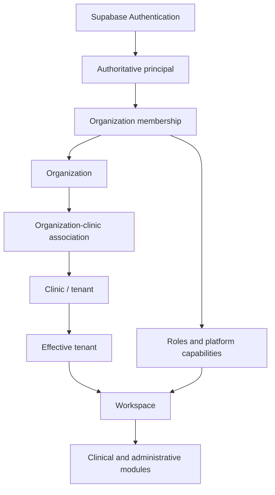

| Layer | Authority | Responsibility |
|---|---|---|
| Authentication | Supabase Authentication | Establish principal identity and session. |
| Organization | Platform Foundation | Own business account, members, clinics, audit, and organization-scoped policy. |
| Clinic | Organization-tenant association | Represent an operating clinic without losing organization ownership. |
| Effective tenant | Server selection plus Supabase session metadata | Select the one clinic context used by workspace operations. |
| Workspace | Existing application shell | Enter only after authoritative tenant refresh and equality validation. |
| Modules | Clinical/administrative bounded contexts | Consume Platform Foundation; never recreate it. |

## 3. Organization model

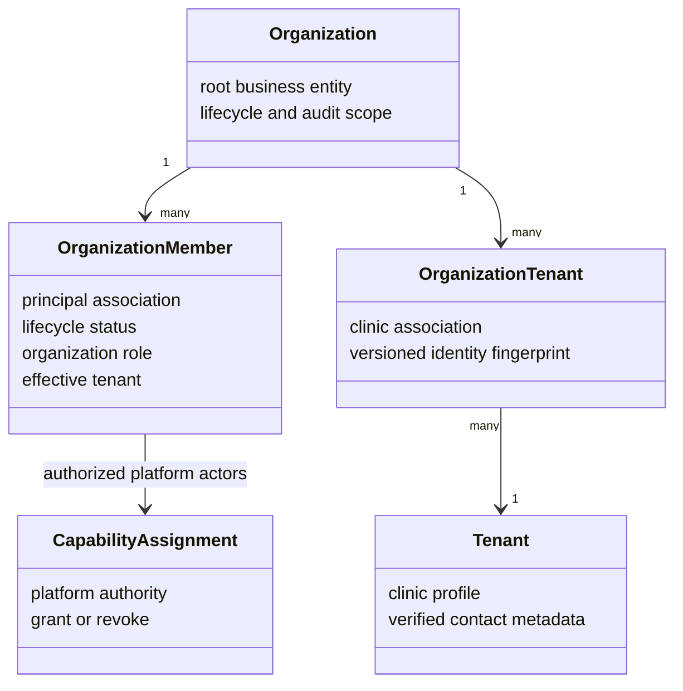

An organization owns membership and clinic association. A clinic never floats
outside an organization-facing association in Platform Foundation. The
organization owner is the first active member created with an initial
organization. Organization administrators and clinic administrators are
membership/RBAC concepts with bounded authority; neither is represented by an
`is_org_admin` shortcut.

Membership has a lifecycle and is resolved independently of authentication.
Roles describe organization or clinic responsibility. Platform capabilities
authorize sensitive platform-wide operations such as manual verification.
Capability assignments are database-authoritative, audited, and separate from
ordinary tenant RBAC.

## 4. Authentication

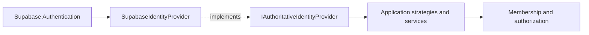

Supabase remains authoritative for authentication, identity confirmation, and
session metadata. `IAuthoritativeIdentityProvider` prevents application policy
from depending on Supabase SDK details. `SupabaseIdentityProvider` is the
current adapter and provides backend-only authoritative identity evidence to
automatic contact verification.

The abstraction is an extension seam, not permission to introduce a second
active authority. A future provider must satisfy the same fail-closed identity,
confirmation, evidence, and audit contract and requires an approved platform
decision. Frontend claims never substitute for authoritative provider evidence.

## 5. Identity lifecycle

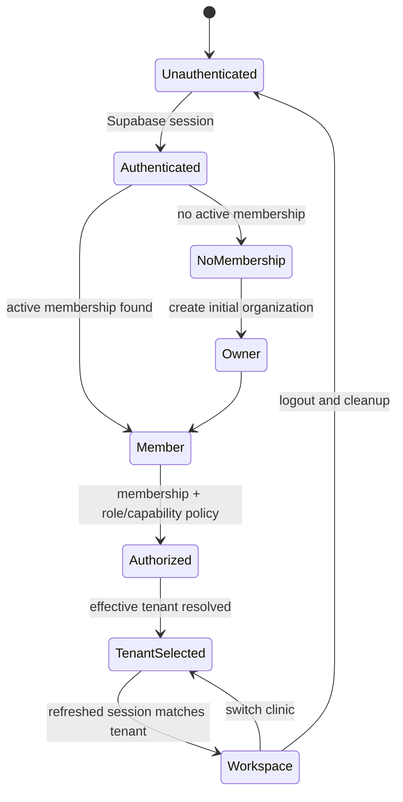

Authentication identifies a user. Organization membership gives that user a
business context. Authorization evaluates membership, roles, capabilities, and
target scope. Effective-tenant selection chooses the clinic. Only a refreshed,
server-confirmed match permits workspace handoff.

## 6. Verification architecture

Contact verification proves that an approved clinic contact method is verified.
Ownership verification proves authority to associate an existing clinic with an
organization. They are separate lifecycles with separate evidence and failure
states.

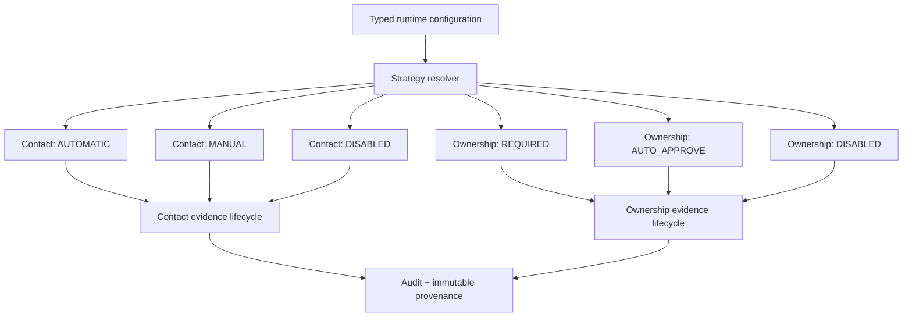

- **Automatic contact verification** obtains confirmed email/mobile evidence
  through `IAuthoritativeIdentityProvider`, normalizes both sides, requires an
  exact match, and fails closed on provider uncertainty.
- **Manual contact verification** requires a platform-capable human reviewer and
  supports request, approve, reject, revoke, expire, and consume transitions.
- **Disabled contact verification** is a constrained non-production/test path,
  not a client-controlled bypass.
- **Required ownership verification** consumes authoritative ownership evidence
  before association.
- **Auto-approve ownership** records immutable system-authority provenance; it
  never fabricates a human approver.
- **Disabled ownership verification** is test-only and constrained by startup
  validation.

Strategy selection replaces router or service conditionals. Every strategy
enters the same lifecycle, repository, provenance, audit, idempotency, and
transaction boundaries.

## 7. Effective tenant

The effective tenant is the one clinic context authorized for subsequent
workspace calls. It is persisted on organization membership and projected into
Supabase session metadata through the existing integration.

- With one eligible clinic, the server can select it automatically.
- With multiple eligible clinics, the user chooses from the server-authorized
  set; the client cannot nominate an arbitrary tenant.
- Selection is committed before session refresh.
- The frontend refreshes backend context and Supabase session state, then
  requires exact equality with the intended tenant before navigation.

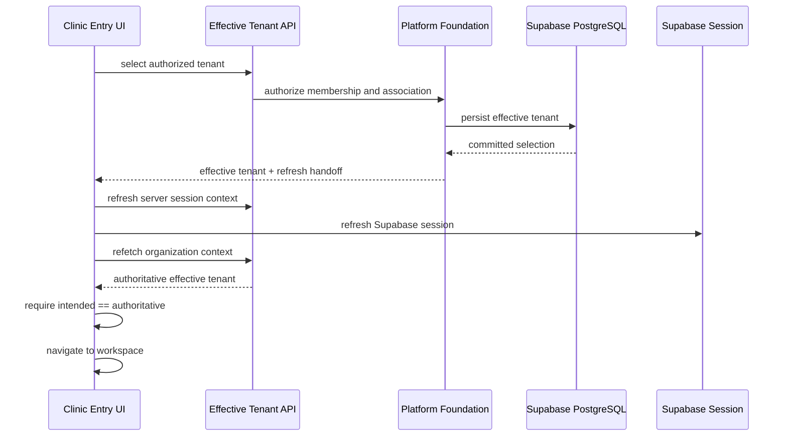

Tenant switching first cancels active queries, removes the outgoing persisted
wizard draft for the tenant/user identity, clears operation and idempotency
state, invalidates cached data, and only then performs refreshed-context
validation and navigation. Late responses cannot restore the old context.

## 8. Runtime composition

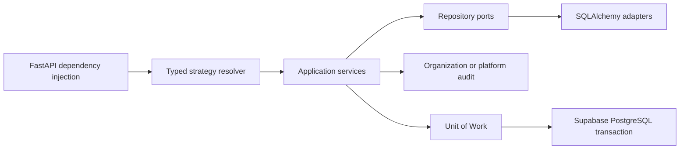

Dependencies compose the selected strategies with existing application
services. Routers validate transport and map typed outcomes; they do not contain
business rules. Application services orchestrate domain policy. Repository
ports preserve Clean Architecture. SQLAlchemy adapters flush but do not own the
commit. The calling service owns commit/rollback through the unit of work, so
the protected mutation and mandatory audit/provenance succeed or fail together.

## 9. Clinic Entry

Clinic Entry exposes two approved product paths: **New Clinic** and **Bring Your
Clinic**. It is the integration point between organization context, verification,
tenant provisioning/association, effective-tenant handoff, and Progressive
Experience.

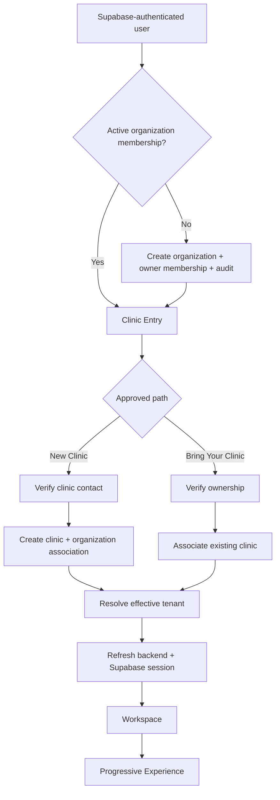

New Clinic uses organization-scoped identity normalization and fingerprint
uniqueness, verified contact persistence, provisioning, association, and
idempotency. Bring Your Clinic accepts an opaque clinic reference, prevents
enumeration, consumes ownership evidence, and associates only after server-side
authorization. Neither path imports data, claims tenants outside the contract,
or trusts client verification declarations.

## 10. Security architecture

| Control | Architectural rule |
|---|---|
| Authentication | Supabase is authoritative; backend validates the principal. |
| Authorization | Resolve membership, target organization, association, role, and capability server-side. |
| Isolation | All organization/tenant operations are scoped; no cross-organization lookup or association leakage. |
| Idempotency | Organization-scoped key plus request fingerprint; replay returns the authoritative prior result and mismatched reuse conflicts. |
| Duplicate protection | Versioned normalized clinic identity fingerprint plus database uniqueness; concurrent conflicts map to typed duplicate errors. |
| Transactions | Mutation, association, provenance, and mandatory audit participate in one caller-owned unit of work. |
| Audit | `org_audit_logs` records organization events; `org_platform_audit_logs` records platform-wide events without requiring organization ID. Both are append-only. |
| Provenance | Human and system verification decisions record immutable, constrained authority provenance. |
| Typed errors | Stable categories cross transport; raw exceptions, evidence, contacts, credentials, and fingerprints never reach clients. |
| Verification | Runtime strategies are server-selected and fail closed in protected environments. |

Platform capability bootstrap is a platform-wide, audited operation. Capability
grant/revoke does not reuse tenant RBAC as a shortcut. An audit failure can roll
back the protected platform operation.

## 11. Frontend architecture

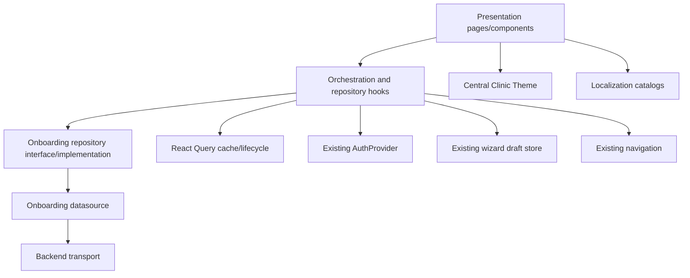

- Presentation renders states, captures accessible input, and invokes
  orchestration. It never performs direct networking.
- The orchestration hook owns the multi-step operation lifecycle, pending/resume,
  retry phase, idempotency-key lifetime, session handoff, cache/draft cleanup,
  stale-result rejection, and navigation gate.
- Repository hooks expose React Query mutations and queries; the datasource owns
  transport paths and DTO mapping.
- Existing auth, organization context, React Query, wizard draft persistence,
  Expo Router, central Theme, icons, error tokens, and English/Hindi localization
  are reused.
- Accessibility is part of presentation state: labels, roles, live/error
  announcements, focus order, loading/disabled semantics, and touch targets must
  remain intact across extensions.

## 12. Backend architecture

| Layer | Responsibility | Representative implementation |
|---|---|---|
| Transport | Schemas, authenticated routes, typed error mapping, delegation | `clinic_entry_router.py`, verification routers, `auth_router.py` |
| Dependency composition | UoW/services/strategies/provider wiring | `clinic_entry_dependencies.py`, `verification_strategy_dependencies.py` |
| Application | Orchestrate authorization, verification, provisioning/association, idempotency, audit, and commit/rollback | `ClinicEntryService`, Platform Foundation services |
| Domain | DTOs, service/repository protocols, typed policy outcomes | `app/domain/dto`, `app/domain/services`, `app/domain/repositories` |
| Infrastructure | SQLAlchemy models/adapters, Supabase provider integration, migrations | `app/infrastructure` and `app/integrations/supabase` |

Platform Foundation is cross-product infrastructure. Clinic Entry consumes it;
it does not own or fork it. Transport-specific types do not become domain
authority, and repositories do not commit independently.

## 13. Database architecture

Supabase PostgreSQL is the single authoritative runtime database. The Platform
Foundation schema covers organizations, organization members,
organization-tenant associations, tenant clinic/contact data, contact and
ownership verification evidence, organization idempotency, organization audit,
platform capability assignments, and platform audit.

Key persistence characteristics:

- clinic identity uses additive `identity_version` and
  organization-scoped `identity_fingerprint` uniqueness;
- legacy rows remain explicitly unknown rather than receiving fabricated
  fingerprints or contact provenance;
- verified contact supports verified email, verified mobile, or both, with
  primary-contact and provenance metadata;
- effective tenant belongs to organization membership;
- audit/provenance records are append-only through normal repositories;
- Alembic migrations are additive and form one current head.

Local PostgreSQL is **not** runtime architecture. A disposable isolated
PostgreSQL database may be used only for migration, downgrade/re-upgrade,
constraint, concurrency, rollback, and drift verification. It never becomes an
alternate runtime system of record. SQLite is not a substitute for these
PostgreSQL semantics.

## 14. Runtime strategy matrix

| Concern | Mode | Intended use | Safeguard |
|---|---|---|---|
| Contact | `AUTOMATIC` | Default staging/production authoritative identity match | Requires provider-confirmed exact normalized match; fail closed. |
| Contact | `MANUAL` | Human review workflow | Requires platform verifier capability and immutable decision provenance. |
| Contact | `DISABLED` | Explicitly permitted non-production testing | Startup validation rejects protected-environment bypass. |
| Ownership | `REQUIRED` | Default staging/production ownership evidence | Association cannot precede consumed authoritative evidence. |
| Ownership | `AUTO_APPROVE` | Approved non-production/system workflow | Records system authority; rejected in production. |
| Ownership | `DISABLED` | Test-only | Rejected outside the narrowly approved environment. |

Mode resolution occurs in backend configuration and DI. Routers and clients do
not select modes. Ambiguous or unsafe protected-environment configuration fails
startup validation.

## 15. Sequence diagrams

### 15.1 User login and organization context

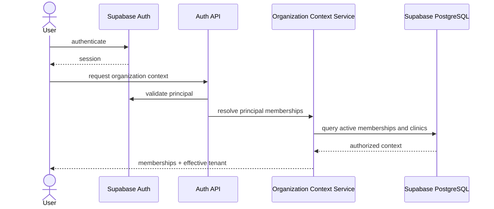

### 15.2 Initial organization creation

```mermaid
sequenceDiagram
    participant UI as Clinic Entry UI
    participant API as Auth API
    participant S as OrganizationAuthorizationService
    participant U as Unit of Work
    UI->>API: create initial organization
    API->>S: authenticated principal + name
    S->>U: lock user; confirm zero memberships
    S->>U: create organization + owner membership + audit
    U-->>S: commit atomically
    S-->>UI: authoritative organization context
```

### 15.3 New Clinic creation and verification

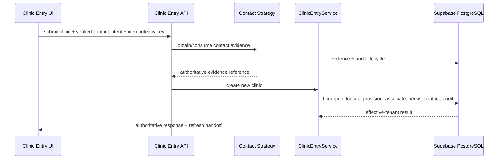

### 15.4 Bring Your Clinic

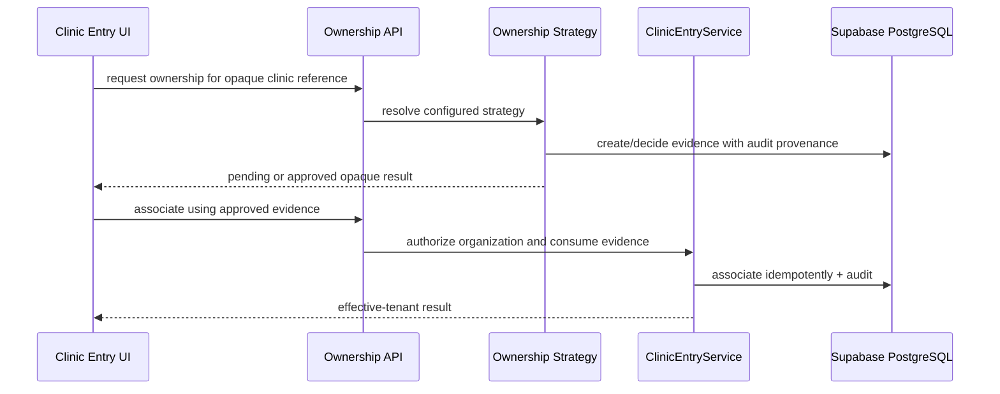

### 15.5 Manual verification lifecycle

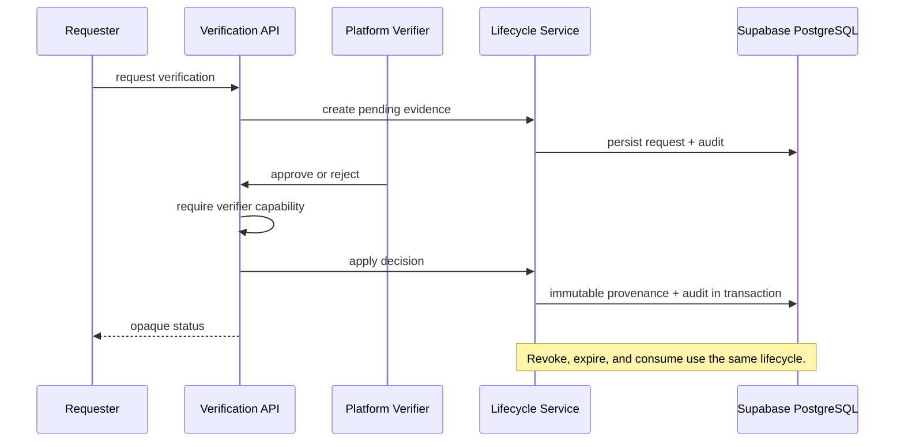

### 15.6 Tenant switch

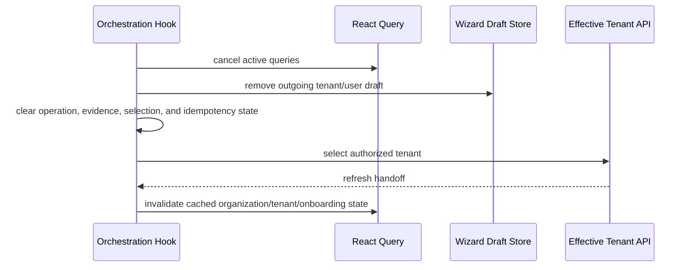

### 15.7 Session refresh and workspace handoff

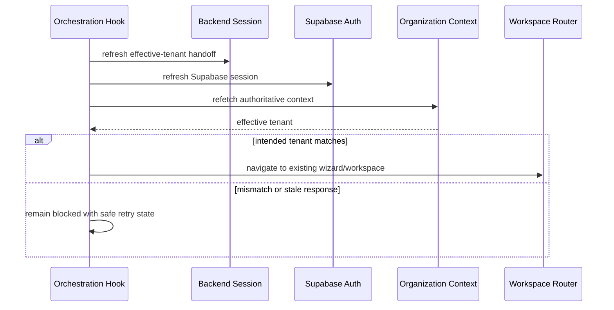

## 16. Extension points

| Extension | Correct approach | Must remain unchanged |
|---|---|---|
| Identity provider | Implement `IAuthoritativeIdentityProvider`, add approved DI selection, and prove fail-closed evidence semantics. | Application policy, Supabase authority until an approved platform decision changes it. |
| Verification strategy | Implement the strategy contract and enter the existing lifecycle, audit, provenance, idempotency, and UoW. | Routers, client authority, evidence state machine. |
| Platform capability | Extend the catalog/assignment service and bootstrap under platform audit. | Tenant RBAC separation and capability authorization. |
| Organization service | Add an application service over existing repository ports and UoW. | Organization root, membership authority, isolation, audit. |
| Repository adapter | Implement the existing port and flush without committing. | Application-owned transaction boundary. |

> **Extension note:** Additive behavior is preferred. If an extension changes an
> invariant, authority, lifecycle, or security boundary, it requires a new or
> superseding platform ADR before implementation.

## 17. Architectural invariants

The following rules must never be broken:

1. Organization is the root business entity for membership and clinic ownership.
2. Every clinic association is organization-scoped.
3. Authentication, membership, authorization, and tenancy remain distinct stages.
4. Supabase Authentication and PostgreSQL remain authoritative runtime systems.
5. `IAuthoritativeIdentityProvider` is the only provider abstraction for authoritative identity evidence.
6. No frontend claim can prove contact verification, ownership, membership, role, capability, or tenant eligibility.
7. Effective tenant must be committed and refreshed before workspace entry.
8. Intended and authoritative effective tenant must match before navigation.
9. Tenant switching cancels in-flight work and clears outgoing tenant-sensitive cache, draft, and operation state.
10. No module bypasses Platform Foundation to derive organization or tenant context.
11. No `is_org_admin`, email-domain, actor-email, or similar shortcut replaces membership/RBAC/capability policy.
12. Platform capabilities remain separate from ordinary tenant RBAC.
13. Verification behavior is selected by typed backend runtime strategies, never route or client conditionals.
14. Protected environments fail closed against disabled/bypass verification modes.
15. Automatic verification uses authoritative confirmed identity and exact normalized comparison.
16. Ownership association consumes authoritative ownership evidence when required.
17. System decisions record system provenance and never fabricate a human actor.
18. Verification evidence and decision provenance are immutable.
19. Organization and platform audit logs are append-only and used for their correct scopes.
20. A mandatory audit failure can roll back the protected operation.
21. Repository adapters flush; the application service owns commit/rollback.
22. Idempotency is scope-bound and request-fingerprint-bound; key reuse with different intent conflicts.
23. Database uniqueness is the concurrency authority for duplicate clinic identity.
24. Raw exceptions, secrets, evidence, contacts, and fingerprints never cross safe transport-error boundaries.
25. Organization and tenant enumeration are prohibited.
26. Legacy unknown identity/contact provenance remains unknown; no synthetic backfill is inferred.
27. Frontend presentation never bypasses repository/datasource boundaries.
28. UI uses central Theme, localization-first English/Hindi catalogs, and accessible interaction semantics.
29. Platform Foundation remains specialty-agnostic and multi-clinic compatible.
30. TG20 and later work consume this foundation; they do not redefine it.

## 18. Prohibited anti-patterns

> **Warning:** Any of the following is an architecture violation, even if it
> appears to shorten an individual feature implementation.

- Direct Axios/fetch calls from presentation components or pages.
- A second auth client, identity authority, organization model, tenant store, or
  effective-tenant resolver.
- Treating Supabase session metadata alone as authorization.
- Accepting organization, capability, ownership, or verification authority from
  client-provided booleans.
- Hardcoding verification modes in routers, services, or UI.
- Bypassing DI by constructing alternate strategy/service graphs in transports.
- Bypassing repository ports or committing inside repository adapters.
- Creating parallel contact, ownership, idempotency, provenance, or audit systems.
- Reusing organization audit for platform-wide events or storing organization ID
  in platform audit.
- Displaying backend exception text or sensitive evidence to users.
- Performing tenant switch without cancellation, invalidation, draft cleanup,
  session refresh, and authoritative equality validation.
- Synthetic identity/contact backfills for legacy rows.
- Using local PostgreSQL, SQLite, or Docker PostgreSQL as runtime authority.
- Introducing clinical, billing, inventory, scheduling, or staff-onboarding rules
  into Platform Foundation.

## 19. Future roadmap ownership

TG20 may plan and build the next approved product epic on top of the accepted
Platform Foundation. It may consume organization context, effective tenant,
roles/capabilities, verification results, audit, idempotency, and existing
frontend/backend boundaries.

TG20 must not redesign organization ownership, Supabase authority, provider
abstraction, membership, effective-tenant selection, verification strategies,
audit/provenance, transaction ownership, clinic identity, or repository
boundaries. A discovered need that changes those contracts returns first to the
Platform Foundation roadmap and ADR process. Task groups consume approved
architecture; they do not redefine it in implementation.

Platform Architecture owns cross-product invariants and platform ADRs. Product
epics own their user journeys while integrating through these contracts.

## 20. Appendix

### 20.1 Glossary and abbreviations

| Term | Meaning |
|---|---|
| ADR | Architecture Decision Record. |
| Effective tenant | The authoritative clinic context selected for the current organization membership/session. |
| Organization | Root business entity owning membership and clinic associations. |
| Organization tenant | Association between an organization and a clinic tenant, including versioned identity. |
| Platform capability | Platform-wide authorization assigned independently of tenant RBAC. |
| Provenance | Immutable record of the human or system authority behind a verification decision. |
| System of Record | Authoritative persistence/identity source; Supabase in current architecture. |
| UoW | Unit of Work controlling atomic commit and rollback. |

### 20.2 Reference ADRs

| ADR | Decision area |
|---|---|
| ADR-PF-003 | Clinic ownership verification |
| ADR-PF-004 | Organization-tenant association |
| ADR-PF-005 | Pre-tenant/organization idempotency |
| ADR-PF-006 | Platform transaction boundary |
| ADR-PF-007 | Organization clinic identity |
| ADR-PF-008 | Verified clinic contact |
| ADR-PF-009 | Clinic contact verification evidence |
| ADR-PF-010 | Manual clinic contact verification |
| ADR-PF-011 | Effective tenant selection |
| ADR-PF-012 | Manual verifier capability |
| ADR-PF-013 | Ownership target context |
| ADR-PF-014 | Platform capability bootstrap |
| ADR-PF-015 | Platform audit log |
| ADR-PF-016 | Manual verification decision provenance |
| ADR-PF-017 | Verification strategy |
| ADR-PF-018 | Automatic verification authority |

### 20.3 Reference implementation files

Backend references are relative to the backend repository; frontend references
are relative to `frontend/` in the React Native repository.

| Area | Files |
|---|---|
| Identity abstraction | `app/domain/services/i_authoritative_identity_provider.py`; `app/infrastructure/auth/supabase_identity_provider.py` |
| Runtime strategy composition | `app/core/config.py`; `app/application/platform/verification_strategies.py`; `app/api/v1/dependencies/services/verification_strategy_dependencies.py` |
| Organization and membership | `app/application/platform/organization_authorization_service.py`; organization/member models and repository ports/adapters |
| Clinic Entry | `app/application/onboarding/clinic_entry_service.py`; `app/api/v1/routers/clinic_entry_router.py`; `app/api/v1/schemas/clinic_entry.py` |
| Effective tenant | `app/application/platform/effective_tenant_selection_service.py`; `app/integrations/supabase/effective_tenant_metadata.py` |
| Verification | contact/manual/ownership services, routers, lifecycle repositories, and evidence models under `app/application/platform`, `app/api/v1`, and `app/infrastructure` |
| Audit and capability | `platform_audit_log.py`; `platform_audit_repository.py`; platform capability assignment/bootstrap services |
| Frontend orchestration | `features/onboarding/presentation/hooks/useClinicEntryOrchestration.ts` |
| Frontend presentation | `features/onboarding/presentation/pages/ChoiceScreen.tsx` |
| Frontend data boundary | `features/onboarding/data/datasources/onboarding.api.ts`; `features/onboarding/data/repositories/onboarding.repository.impl.ts` |
| Frontend contracts | `features/onboarding/domain/clinic-entry.ts`; `features/onboarding/domain/repositories/onboarding.repository.ts` |
| Theme/auth/wizard reuse | `core/theme/useClinicTheme.tsx`; `core/providers/AuthProvider.tsx`; `features/onboarding/presentation/stores/wizard.store.ts` |

### 20.4 Reference evidence and diagrams

- `TG19-FINAL-ACCEPTANCE.md` — controlling acceptance and requirement matrix.
- `TG19-IMPLEMENTATION-READINESS.md` — implementation boundaries and final evidence.
- `TG19-PLATFORM-FOUNDATION-DEPENDENCY-AUDIT.md` — dependency ownership.
- `TG19-FINAL-PLATFORM-FOUNDATION-IMPLEMENTATION-PLAN.md` — bounded delivery history.
- `E2-OPERATIONAL-CONTRACT.md` and `E2-IMPLEMENTATION-BOUNDARY.md` — Clinic Entry contracts.
- Diagrams in §§2, 3, 4, 5, 6, 7, 8, 9, 11, and 15 are the integrated reference diagrams for the accepted architecture.

> **Governance warning:** When this guide and an ADR appear inconsistent, stop.
> Reconcile the factual implementation evidence and approve the appropriate ADR
> or guide revision before writing code. Never resolve an authority conflict by
> silently choosing the more convenient path.
