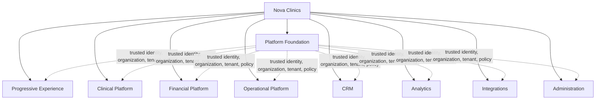
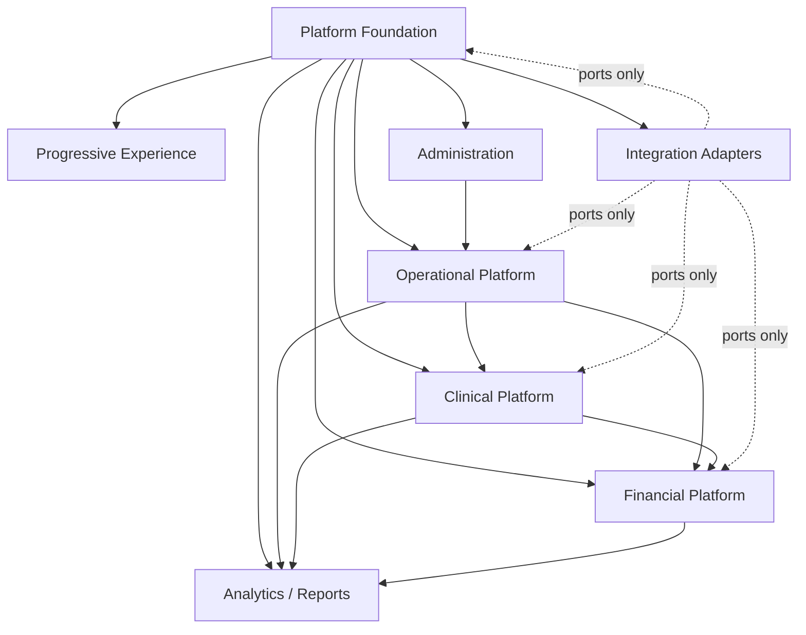
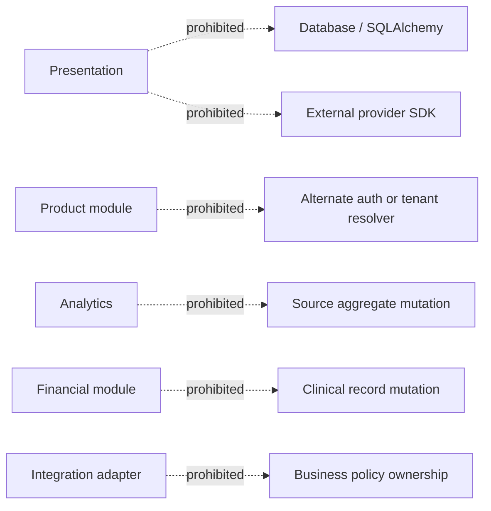
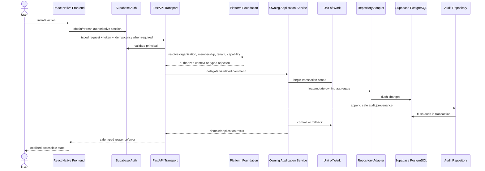
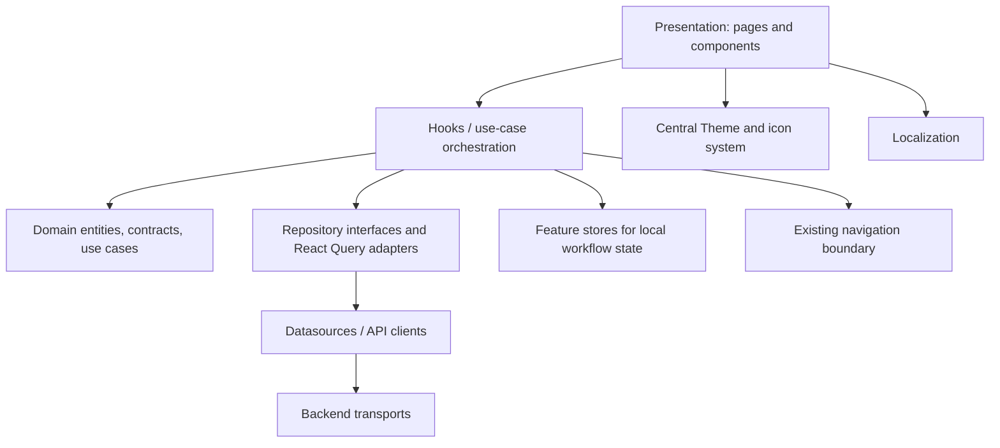
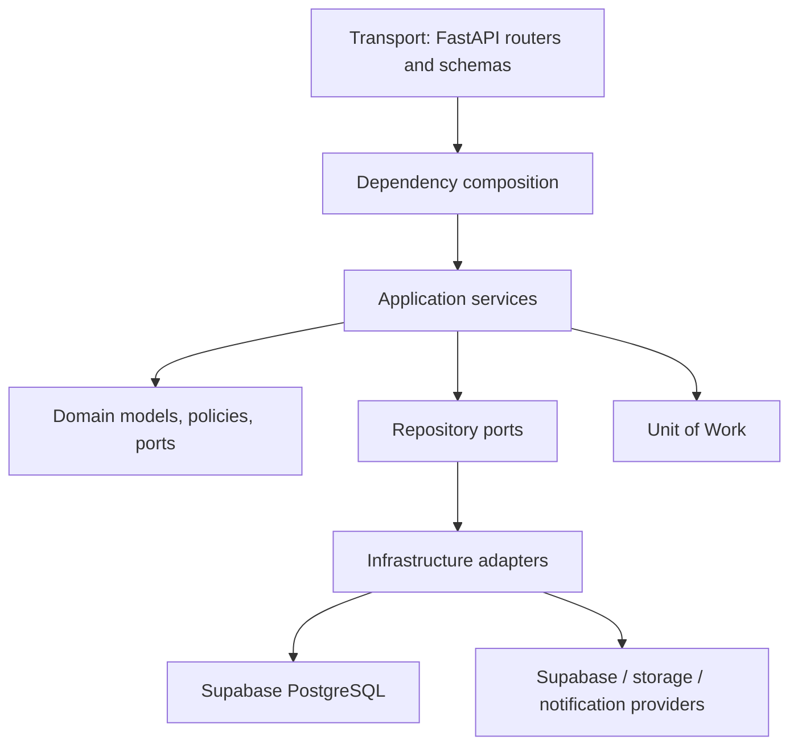
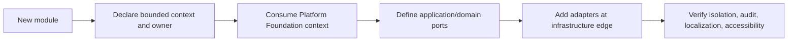
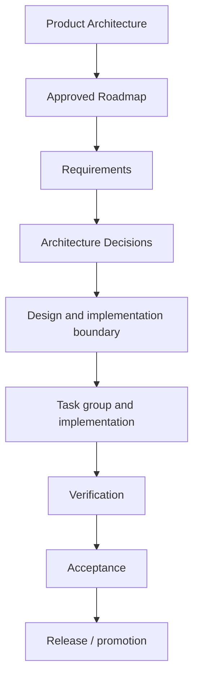

# Nova Clinics Product Architecture

Status: **Authoritative product architecture handbook**

Baseline: **TG19 / Epic 2 Version 1 accepted**

Audience: Solution architects, principal engineers, technical leads, senior developers, reviewers, and AI coding agents

> Start here. This document defines the product-wide module map, dependency
> direction, ownership, extension boundaries, and governance model. The
> Platform Foundation guide and ADRs provide deeper authoritative decisions.
> This handbook does not turn future roadmap areas into implemented behavior.

## 1. Product vision

Nova Clinics is a multi-clinic healthcare operating platform that connects
organization administration, clinic operations, longitudinal clinical work,
financial workflows, and progressive product adoption without collapsing their
ownership boundaries.

The product follows three complementary principles:

- **Organization first:** organizations own membership and clinic associations;
  every workspace action occurs in an authorized organization and effective
  clinic context.
- **Platform first:** identity, authorization, tenancy, capability, audit,
  verification, idempotency, and transaction rules are solved once and consumed
  by every module.
- **Clinical first:** patient safety, longitudinal clinical meaning, provenance,
  and workflow continuity take priority inside clinical contexts. Administrative
  convenience must not corrupt clinical authority.

The architecture supports incremental adoption: Progressive Experience helps an
organization enter and prepare its workspace, while module boundaries let Nova
Clinics expand without constructing parallel identity, tenant, repository, or
audit systems.

> **Product decision:** Platform Foundation establishes trusted context. Product
> modules own business behavior. Neither may absorb the other.

## 2. Product layer architecture

| Layer | Architectural purpose | Current interpretation |
|---|---|---|
| Platform Foundation | Trusted identity, organization, clinic tenancy, authorization, capabilities, verification, audit, idempotency, and transactions. | Implemented and accepted through TG19. |
| Progressive Experience | Guides clinic entry, workspace preparation, readiness, and progressive adoption. | Implemented foundation and accepted Clinic Entry; later roadmap epics remain separately governed. |
| Clinical Platform | Owns patient-facing clinical records and longitudinal care workflows. | Multiple implemented modules exist; the broader future Clinical Workspace remains separately governed. |
| Financial Platform | Owns charge, invoice, payment, and financial-state concepts. | Billing surfaces exist; future financial expansion and payment-gateway work are not implied. |
| Operational Platform | Owns scheduling, resources, staff operations, inventory, and day-to-day clinic execution. | Several modules exist with independent maturity; future expansion requires its own requirements and acceptance. |
| CRM | Owns prospect/referral/relationship workflows outside the clinical patient record. | Future product area; no complete CRM architecture is asserted here. |
| Analytics | Produces authorized derived insights and reports from source-owned data. | Analytics/reporting modules exist; a generalized analytics platform remains future work. |
| Integrations | Adapts approved external systems at explicit ports. | Existing storage, Supabase, notification, and selected provider integrations exist; a general integration marketplace does not. |
| Administration | Provides governed configuration for platform, organization, clinic, RBAC, capabilities, templates, localization, and branding. | Implemented across bounded administrative modules. |

## 3. Platform Foundation

Platform Foundation is described authoritatively in
`NOVA-PLATFORM-FOUNDATION-ARCHITECTURE.md`. Product modules must consume that
guide rather than duplicate it.

It owns:

- Supabase-backed authoritative identity abstraction;
- organizations, memberships, clinic associations, and effective tenant;
- organization roles and platform capabilities;
- contact and ownership verification strategy composition;
- scoped idempotency, immutable audit/provenance, and transaction rules;
- safe transport errors and isolation invariants.

It never owns patient care, consultation content, appointments, episodes, case
sheets, prescriptions, treatment planning or delivery, invoices, payments,
inventory, CRM journeys, or module-specific UX.

> **Boundary note:** A module may request an authenticated principal,
> organization context, effective tenant, or authorization decision. It may not
> infer or persist an alternate version of any of them.

## 4. Product module map

Status labels distinguish repository evidence from roadmap organization:

- **Implemented:** a concrete module boundary exists in the current repositories.
- **Implemented foundation:** a bounded implementation exists, but this document
  does not claim every future journey is complete.
- **Future product area:** logical ownership is recorded without asserting an
  implementation.

### 4.1 Platform and administration modules

| Module | Status | Purpose and owner | Dependencies | Consumers |
|---|---|---|---|---|
| Authentication | Implemented | Supabase authentication adapter and application identity boundary; Platform Foundation owns policy. | Supabase Authentication, configuration. | Every authenticated module. |
| Organization | Implemented | Organization root, membership, owner/admin lifecycle, and organization audit; Platform Foundation. | Authentication, transactions, repositories. | Clinic Entry, administration, every organization-scoped module. |
| Clinics / Tenants | Implemented | Clinic profile, organization association, identity/contact persistence, and effective-tenant context; Platform Foundation plus clinic administration. | Organization, verification, Supabase session metadata. | Workspace and all tenant-scoped modules. |
| Staff and RBAC | Implemented | Staff records, invitations/access, tenant roles, permissions, and working context; Administration/Operations. | Organization/tenant context, auth, capabilities where applicable. | Scheduling, clinical modules, billing, administration. |
| Platform Capabilities | Implemented | Platform-wide sensitive-operation authorization and audited assignment/bootstrap; Platform Foundation. | Authenticated platform actor, platform audit. | Manual verification and future platform administration. |
| Global/Clinic Settings | Implemented foundation | Govern platform, organization, and clinic configuration at the correct scope. | Platform Foundation, localization, feature flags. | Product modules reading approved configuration. |
| Templates | Implemented | Reusable organization/clinic configuration templates and clinical templates where bounded. | Tenant context, authorization. | Case sheets, configuration workflows, onboarding. |
| Tenant Branding | Implemented | Tenant-owned presentation branding configuration. | Effective tenant, theme boundary. | Frontend shell and authorized branded surfaces. |
| Localization | Implemented | Locale catalogs and localized configuration/labels. | Configuration and frontend localization infrastructure. | Every user-visible module. |

### 4.2 Progressive Experience and operational modules

| Module | Status | Purpose and owner | Dependencies | Consumers |
|---|---|---|---|---|
| Progressive Experience | Implemented foundation | Clinic Entry, readiness journey, wizard progression, draft recovery, and workspace preparation; Product Experience. | Platform Foundation, onboarding repository, theme, localization, navigation. | New and returning organization/clinic users. |
| Appointments | Implemented | Appointment lifecycle and schedule-facing booking state; Operational Platform. | Patient, clinic, staff/resource availability, authorization. | Consultation, episodes, billing, notifications, dashboards. |
| Appointment Rules | Implemented | Clinic scheduling constraints and rule configuration. | Clinic settings, operating hours, rooms, staff availability. | Appointment creation and validation. |
| Operating Hours | Implemented | Clinic availability windows. | Effective tenant, clinic administration. | Scheduling and appointment rules. |
| Rooms | Implemented | Clinic resource/location configuration. | Effective tenant, clinic administration. | Appointment and treatment-session allocation. |
| Staff Operations | Implemented foundation | Staff lists, dashboards, availability, and role-specific work surfaces. | Staff/RBAC, effective tenant, appointments. | Operational and clinical workspaces. |
| Inventory | Implemented foundation | Stock, batches, and treatment-material usage ownership. | Effective tenant, authorization, clinical/financial references where approved. | Treatment delivery, operations, financial reconciliation. |
| Notifications | Implemented foundation | Notification delivery and user preferences. | Identity/contact channels, events, tenant/user preferences. | Appointments and approved product workflows. |
| Documents / Bulk Upload | Implemented foundation | File/document ingestion and storage-adapter workflows. | Authorization, storage ports, tenant context, validation. | Administrative and approved clinical workflows. |

### 4.3 Clinical modules

| Module | Status | Purpose and owner | Dependencies | Consumers |
|---|---|---|---|---|
| Patients / Clients | Implemented | Authoritative tenant-scoped patient identity and demographic record; Clinical Platform. | Effective tenant, authorization, validation. | Appointments, episodes, case sheets, prescriptions, treatment, billing. |
| Consultation | Implemented foundation | Clinician encounter workflow and consultation-facing workspace behavior. | Patient, appointment, staff/RBAC, clinical services. | Episodes, case sheets, prescriptions, treatment planning. |
| Episodes | Implemented | Longitudinal episode-of-care boundary and lifecycle. | Patient, appointment/clinical context, authorization. | Case sheets, treatment plans, clinical timelines, reports. |
| Case Sheets | Implemented | Structured clinical documentation and templates with clinical provenance. | Patient, episode, staff identity, templates. | Clinical review, treatment decisions, reports. |
| Prescriptions | Implemented | Medication/prescription record and related clinical actions. | Patient, encounter/episode context, prescriber authorization. | Patient care, clinical review, documents. |
| Clinical Services | Implemented | Catalog of clinical services and their operational/financial references. | Tenant configuration and capabilities. | Appointments, treatment, billing. |
| Treatment Plans | Implemented foundation | Planned course of treatment and approved clinical progression. | Patient, episode, clinical services, authorized clinician. | Treatment sheets/sessions, clinical review, billing references. |
| Treatment Sheets | Implemented | Longitudinal execution/recording structure for treatment delivery. | Treatment plan, patient, staff, clinical semantics. | Treatment sessions, dashboards, reports. |
| Treatment Sessions | Implemented | Session-level treatment delivery workflow and status. | Treatment plan/sheet, appointment, staff, inventory where approved. | Clinical timeline, billing references, reports. |
| Clinical Dashboards | Implemented foundation | Role-specific doctor/therapist clinical views and timelines. | Clinical source modules, effective tenant, RBAC. | Doctors, therapists, reviewers. |

### 4.4 Financial, relationship, insight, and integration modules

| Module | Status | Purpose and owner | Dependencies | Consumers |
|---|---|---|---|---|
| Billing / Invoices | Implemented foundation | Tenant financial documents and charge/invoice state; Financial Platform. | Patient, clinical service/treatment references, authorization. | Clinic administration, reports, future payments. |
| Payments | Future product area | Payment collection, settlement, refund, and gateway orchestration. | Billing plus approved provider ports and audit. | Financial operations and reporting. |
| CRM | Future product area | Prospects, referrals, campaigns, and non-clinical relationships. | Platform Foundation; explicit patient-conversion contract if approved. | Growth and relationship teams. |
| Feedback | Implemented foundation | User/patient feedback capture within approved context. | Tenant context, safe identity/contact handling. | Administration and analytics. |
| Reports | Implemented foundation | Authorized operational/clinical/financial read models and exports. | Source module contracts, effective tenant, authorization. | Owners, administrators, clinicians. |
| Analytics | Implemented foundation | Derived metrics and dashboards without taking source-data ownership. | Source module read contracts, authorization, tenant isolation. | Dashboards, reports, product decision support. |
| AI Assistance | Future product area | Assistive, reviewable intelligence over explicitly authorized product data. | Source-owned contracts, privacy/security governance, audit. | Future clinical and administrative workflows. |
| External Integrations | Implemented adapters plus future area | Supabase, storage, notifications, and approved provider adapters; future integrations enter through ports. | Platform configuration, secrets boundary, authorization. | Modules requiring external services. |

## 5. Module dependency graph

The graph describes allowed conceptual dependencies, not permission for arbitrary
database access. Each dependency must use an owned application contract, domain
port, event, or read model.

### Prohibited dependencies

Other modules may reference clinical or operational identifiers, but they do
not take ownership of the source aggregate. Analytics reads; it does not become
the source. Financial workflows reference clinical services; they do not edit
clinical truth.

## 6. Bounded contexts

| Bounded context | Owns | Contract boundary |
|---|---|---|
| Identity and Access | Authenticated identity adapter, membership authorization, tenant RBAC, platform capabilities. | Principal/context/decision interfaces; no module-owned auth copies. |
| Organization and Tenancy | Organization, membership, clinic association, effective tenant. | Platform Foundation application services and repository ports. |
| Verification and Trust | Contact/ownership evidence, strategies, decisions, provenance. | Typed lifecycle operations and opaque evidence references. |
| Progressive Experience | Journey projection, Clinic Entry orchestration, wizard readiness and recovery. | Onboarding repository/datasource and Platform Foundation APIs. |
| Patient Registry | Patient/client identity and demographics within tenant. | Patient application API/repository; identifiers referenced elsewhere. |
| Scheduling and Resources | Appointments, rules, operating hours, rooms, availability. | Scheduling application services and events/read models. |
| Clinical Record | Episodes, case sheets, prescriptions, clinical semantics and provenance. | Clinical commands/queries; protected source aggregates. |
| Treatment Delivery | Treatment plans, sheets, sessions, lifecycle actions. | Treatment application services and explicit clinical references. |
| Financials | Invoices, line items, financial status; future payment boundary. | Financial commands/queries; references but does not own patient/clinical entities. |
| Inventory | Items, batches, stock movement, material usage. | Inventory commands/queries and explicit treatment-usage contract. |
| Communications | Notifications, preferences, feedback channels. | Event/notification ports and user preferences. |
| Insight | Analytics, KPI, and reports. | Authorized read models; no source writes. |
| Administration | Settings, templates, branding, localization configuration. | Scope-aware configuration services. |
| Integrations | External provider adapters and storage/communication clients. | Domain/application ports; adapters own protocol, not policy. |

The shared kernel is intentionally small: stable identifiers, tenant context,
time/value primitives, safe typed errors, pagination/transport conventions, and
cross-cutting interfaces. Patient, appointment, episode, invoice, inventory, or
verification models do not enter the shared kernel merely because multiple
modules reference them.

> **DDD rule:** Referencing another context's identifier does not transfer
> aggregate ownership. Cross-context mutation goes through the owning context.

## 7. End-to-end request lifecycle

1. Presentation captures intent; it does not decide authority.
2. Supabase proves authentication.
3. Platform Foundation resolves organization, membership, effective tenant, and
   capability context.
4. Transport validates and delegates.
5. The owning application service enforces business policy.
6. Repository adapters load/flush through ports.
7. Supabase PostgreSQL is authoritative.
8. Mandatory audit/provenance participates in the same transaction.
9. Safe typed outcomes return to localized, accessible UI.

## 8. Cross-cutting concerns

| Concern | Architectural owner | Product-wide rule |
|---|---|---|
| Authentication | Platform Foundation / Supabase adapter | Supabase is authoritative; no alternate auth system. |
| Authorization | Platform Foundation plus owning module policy | Membership/tenant/capability is server-resolved; modules add domain authorization. |
| Effective tenant | Platform Foundation | Must be committed and refreshed before workspace/module access. |
| Audit | Platform Foundation infrastructure and owning application service | Organization vs platform scope is explicit; records are append-only. |
| Logging | Backend core infrastructure | Structured operational diagnostics; never substitute for audit or expose secrets. |
| Idempotency | Platform Foundation service plus operation owner | Scope and request fingerprint are mandatory for protected retries. |
| Configuration | Core settings and scoped administration | Typed, environment-validated, fail closed for security decisions. |
| Localization | Frontend localization plus configuration-owned labels | User-visible text uses catalogs; `en-US` and `hi-IN` parity for introduced strings. |
| Accessibility | Frontend presentation | Accessible roles, names, focus, live states, target sizes, and navigation are acceptance concerns. |
| Feature flags | Core/platform configuration | Flags gate approved behavior; they do not replace authorization or architecture. |
| Validation | Transport, domain, and database at distinct layers | Shape at transport, invariant in domain/application, concurrency/uniqueness in database. |
| Transactions | Application service and UoW | Repository flushes; caller commits/rolls back mutation and required audit atomically. |
| Error handling | Domain/application typed failures and transport mapping | Stable safe categories; no raw backend/provider/database text reaches UI. |

## 9. Frontend architecture

- **Presentation** renders domain/view state and accessible interaction; it does
  not perform direct networking or own persistence policy.
- **Domain** holds frontend entities, repository contracts, pure projections,
  and use cases without React Native or transport authority.
- **Data** maps API DTOs through datasources and repository implementations.
- **React Query** owns server-state caching, invalidation, cancellation, and
  mutation lifecycle. It is not a general local form store.
- **Stores** own bounded local/draft state with identity-aware cleanup. They do
  not duplicate server authority.
- **Navigation** occurs through existing routes and only after required
  authoritative context checks.
- **Theme/localization/accessibility** are mandatory architecture constraints,
  not post-implementation polish.

Feature folders should preserve this dependency direction. Cross-feature reuse
belongs in stable core abstractions or explicit contracts, not deep imports into
another feature's presentation internals.

## 10. Backend architecture

- Transport authenticates, validates shape, delegates, and maps typed errors.
- Dependency injection composes configured services and strategies; routers do
  not construct business graphs or branch on runtime policy.
- Application services orchestrate use cases, authorization, idempotency,
  repositories, audit, and transaction completion.
- Domain code owns business concepts, invariants, repository/service protocols,
  and typed failures.
- Infrastructure implements persistence, provider, event, cache, storage, and
  notification ports.
- Supabase remains authoritative for authentication, PostgreSQL, and approved
  session metadata.

## 11. Data ownership

| Entity / data family | Authoritative owner | Other-module access rule |
|---|---|---|
| Organization | Organization and Tenancy / Platform Foundation | Consume organization context/services; never duplicate. |
| Organization membership | Identity and Access / Platform Foundation | Server-resolved authorization only. |
| Clinic / tenant | Organization and Tenancy plus clinic administration | Reference effective tenant; changes use owning service. |
| Effective tenant | Platform Foundation | Read refreshed authoritative context; never infer client-side. |
| Verification evidence/provenance | Verification and Trust | Opaque references/status; no raw evidence leakage. |
| Platform capability | Platform Foundation | Consume capability decision; tenant RBAC is not a substitute. |
| Patient/client | Patient Registry | Clinical/operational/financial modules reference patient ID through contracts. |
| Appointment | Scheduling and Resources | Clinical and financial contexts consume explicit status/reference contracts. |
| Episode | Clinical Record | Treatment/reporting contexts reference; mutations stay clinical. |
| Case sheet | Clinical Record | Read through authorized clinical services; provenance is protected. |
| Prescription | Clinical Record | Patient/episode-scoped clinical ownership. |
| Treatment plan/sheet/session | Treatment Delivery | Other contexts use explicit references/events/read models. |
| Invoice | Financials | Clinical modules cannot mutate financial state directly. |
| Payment | Future Payments context | When approved, references invoices through financial contracts. |
| Inventory item/batch/movement | Inventory | Treatment usage uses the approved inventory boundary. |
| Organization audit | Platform Foundation | Append through organization audit port; no update/delete. |
| Platform audit | Platform Foundation | Platform-wide safe events only; no organization ID requirement. |
| Analytics/report output | Insight | Derived data; source modules remain authoritative. |

## 12. Extension strategy

Nova Clinics uses explicit extension ports rather than an unconstrained runtime
plugin marketplace.

To add a module:

1. Define its business purpose, aggregate ownership, personas, requirements, and
   explicit non-goals.
2. Map inbound/outbound dependencies and prohibit direct source-table ownership.
3. Reuse Platform Foundation identity, organization, tenant, capability, audit,
   idempotency, and transaction services.
4. Create ports only for a real boundary; extend existing repositories/services
   where ownership already exists.
5. Keep provider SDKs and protocols in infrastructure adapters.
6. Add focused contract, isolation, security, localization, accessibility, and
   integration evidence before acceptance.

Extensions are additive. A module cannot redefine a Platform Foundation
invariant. An architectural conflict returns to roadmap/requirements/ADR review
before code.

## 13. Architectural governance

| Artifact | Authority and owner |
|---|---|
| Product Architecture | Product Architecture owns the system-wide module map, dependency direction, and governance invariants. |
| Platform Foundation guide | Platform Architecture owns cross-product identity, organization, tenant, security, and runtime foundation contracts. |
| Roadmap | Product Architecture/Product owns approved product scope and sequence. |
| Requirements | Product owns observable behavior and acceptance criteria. |
| ADR | Architecture owns a durable decision, alternatives, consequences, and extension points. |
| Design | Solution Architecture owns concrete component/data/interaction boundaries consistent with requirements and ADRs. |
| Implementation readiness | Engineering and Architecture prove reuse, dependencies, decisions, files, and tests are sufficiently bounded. |
| Acceptance | Product, Architecture, Security, and Engineering verify delivered behavior and evidence. |
| Release | Release ownership validates environment, migration, operational, and promotion gates. |

> **Governance rule:** Product Architecture does not silently override an ADR;
> a task group does not redefine requirements; implementation does not create
> product scope. Conflicts stop and move upstream.

## 14. Canonical AI agent rules

AI coding agents working in Nova Clinics must obey all of the following:

1. Read this handbook, the Platform Foundation guide, applicable roadmap,
   requirements, design, ADRs, readiness boundary, and repository instructions
   before modifying code.
2. Never bypass Platform Foundation for authentication, organization,
   membership, capability, verification, or effective-tenant decisions.
3. Never create an alternate identity provider, organization model, tenant
   store, session authority, audit system, or tenant resolver without an
   approved architecture decision.
4. Never accept client-declared membership, role, capability, ownership,
   verification, or tenant authority.
5. Reuse existing components, hooks, stores, services, repositories, APIs,
   navigation, Theme, localization, and infrastructure before creating anything.
6. Never duplicate a repository or service because its interface is inconvenient;
   audit ownership and extend the existing boundary when appropriate.
7. Preserve Clean Architecture dependency direction. Presentation does not call
   the network directly; domain does not depend on frameworks; repositories do
   not own commit.
8. Preserve bounded-context ownership. Reference foreign identifiers through
   contracts; do not mutate another context's aggregate or table directly.
9. Preserve Supabase as authoritative authentication and PostgreSQL runtime.
10. Preserve organization and tenant isolation in queries, commands, caches,
    events, audit, retries, and tests.
11. Preserve idempotency, typed errors, immutable audit/provenance, and
    application-owned transaction boundaries.
12. Never log or expose credentials, tokens, raw verification evidence, contact
    values, fingerprints, raw provider responses, or internal exception text.
13. Use central Theme tokens only and localization-first `en-US`/`hi-IN` strings;
    preserve accessible semantics and multi-clinic/specialty neutrality.
14. Treat feature flags as behavior gates, never authorization substitutes.
15. Inspect the actual repository before proposing new architecture. Planning
    summaries are evidence pointers, not substitutes for source review.
16. Do not modify historical migrations, unrelated modules, or other worktrees.
17. Do not broaden a task because a useful adjacent improvement is visible.
18. If a required dependency or decision is undocumented, stop and record the
    blocker; do not invent architecture.
19. Run focused tests and applicable static/migration checks proportional to
    risk, then classify unrelated baseline debt explicitly.
20. Stage only reviewed files, preserve user changes, and report exact commit,
    push, and synchronization status.

> **AI warning:** A locally coherent implementation is still invalid if it
> violates product ownership, an ADR, tenant isolation, or the authorized task
> boundary.

## 15. Development workflow

| Stage | Required outcome | Primary responsibility |
|---|---|---|
| Requirements | Observable behavior, personas, acceptance, metrics, and non-goals. | Product with Architecture review. |
| Architecture | Context ownership, dependencies, invariants, and reuse direction. | Product/Solution Architecture. |
| ADR | Durable decisions for meaningful alternatives or cross-product authority. | Platform/Solution Architecture. |
| Design | Concrete domain, interaction, persistence, transport, and extension contracts. | Solution Architecture and senior engineering. |
| Implementation readiness | Exact reuse audit, open decisions closed, files/tests bounded. | Engineering lead and Architecture. |
| Implementation | Small authorized checkpoints following approved contracts. | Engineering. |
| Verification | Unit, contract, integration, security, isolation, migration, frontend, and non-functional evidence. | Engineering, QA, Security. |
| Acceptance | Requirement matrix and journeys classified with no owned blocker. | Product, Architecture, Engineering, QA. |
| Release | Staging/runtime configuration, migration, observability, rollback, and promotion gates. | Release/Operations with owners. |

The direction is forward. Discovery can send work back upstream, but an
implementation artifact never retroactively becomes an unreviewed requirement
or architecture decision.

## 16. Module roadmap

The following are logical future product areas, not implementation commitments:

| Area | Evolution intent | Non-negotiable foundation |
|---|---|---|
| Clinical Workspace | Unify safe role-specific clinical work around existing patient, episode, case-sheet, prescription, and treatment ownership. | Consume Platform Foundation and preserve clinical aggregate provenance. |
| Financials | Mature charge, invoice, payment, settlement, and reporting journeys. | Reference clinical/operational facts; do not take ownership of them. |
| Inventory | Expand procurement, stock, usage, reconciliation, and controls. | Remain tenant-isolated and integrate through treatment/financial contracts. |
| CRM | Add prospects, referrals, campaigns, and relationship workflows. | Stay separate from clinical patient truth until an approved conversion contract. |
| Analytics | Expand governed derived read models and decision support. | Never become a write authority for source contexts. |
| AI Assistance | Add assistive, reviewable, privacy-safe intelligence. | Human accountability, source provenance, authorization, audit, and no autonomous authority escalation. |
| External Integrations | Add approved provider adapters and interoperability. | Ports/adapters, secret isolation, idempotency, audit, and source-context ownership. |

TG20 may plan the next approved Progressive Experience epic. It must consume the
accepted Platform Foundation and this module map rather than redesign either.

## 17. Unified glossary

| Term | Product meaning |
|---|---|
| Aggregate | Transactional consistency boundary owned by one bounded context. |
| ADR | Architecture Decision Record documenting a durable decision and consequences. |
| Bounded context | Explicit domain boundary with its own language, models, and authority. |
| Capability | Platform-wide authorization for sensitive platform operations; distinct from tenant RBAC. |
| Clinic | Operating care location represented as a tenant and associated with an organization. |
| Clinical Platform | Contexts owning patient care records and longitudinal treatment workflows. |
| Effective tenant | Authoritative clinic selected for the current membership/session. |
| Organization | Root business entity owning members and clinic associations. |
| Platform Foundation | Cross-product identity, organization, tenancy, verification, security, audit, idempotency, and transaction foundation. |
| Progressive Experience | Product experience guiding clinic entry, setup, readiness, and adoption. |
| Provenance | Immutable record of the human/system authority or source behind a decision or clinical fact. |
| Repository port | Domain/application persistence contract implemented by infrastructure. |
| Shared kernel | Deliberately small common concepts shared across contexts. |
| Supabase | Current authoritative authentication, PostgreSQL, and approved session-metadata platform. |
| Tenant | Clinic-scoped data and authorization boundary. |
| UoW | Unit of Work controlling atomic commit/rollback across mutation and mandatory audit. |

## 18. Reference documents

| Document family | Purpose |
|---|---|
| `NOVA-PLATFORM-FOUNDATION-ARCHITECTURE.md` | Authoritative integrated guide to implemented Platform Foundation behavior and invariants. |
| ADR-PF-003 through ADR-PF-018 | Durable Platform Foundation decisions for ownership, association, idempotency, transactions, identity/contact, verification, tenant selection, capabilities, audit, provenance, and runtime strategies. |
| `requirements.md` | Canonical Progressive Experience product requirements and acceptance criteria. |
| `design.md` | Canonical Progressive Experience solution design and delivery constraints. |
| `PROGRESSIVE-EXPERIENCE-PHASE2-ROADMAP.md` | Approved remaining Progressive Experience product sequence and governance. |
| `TG19-FINAL-ACCEPTANCE.md` | Controlling TG19 acceptance decision and requirement/journey evidence. |
| `TG19-IMPLEMENTATION-READINESS.md` | TG19 engineering boundary, dependencies, reuse, risks, tests, and final readiness history. |
| Epic constitutional documents | Epic-specific behavior/domain/operational contracts subordinate to roadmap and platform decisions. |
| `tasks.md` | Authorized task-group delivery history and verification record; not an independent source of new scope. |

> **Conflict protocol:** If this handbook, the Platform Foundation guide, an ADR,
> requirements, design, or implementation evidence appears inconsistent, stop.
> Identify the owning authority and approve the upstream correction before code.
> Never resolve a governance conflict by silently choosing the easiest document.
