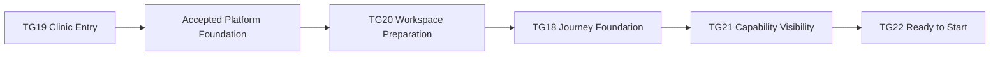
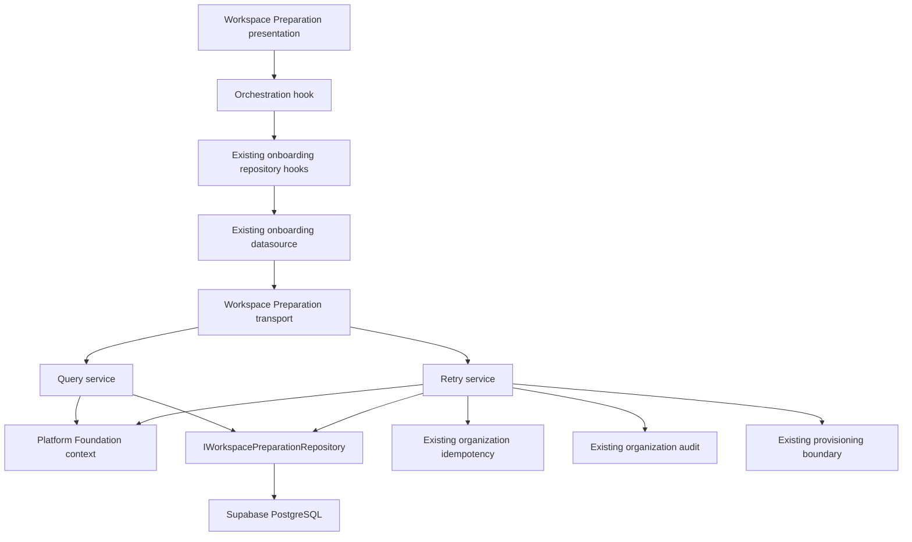
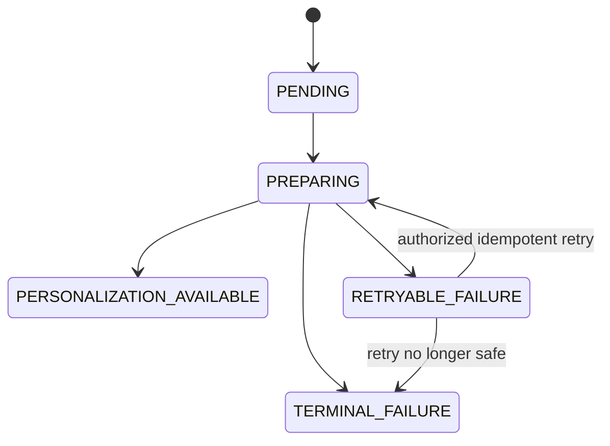

# TG20 Architecture — Workspace Preparation

Status: **Proposed implementation architecture; no implementation authorized**

## Architectural position

TG20 is a Progressive Experience module. It consumes Platform Foundation
identity, organization, effective tenant, audit, idempotency, transactions,
capabilities, DI, and typed errors. It does not own provisioning mechanics that
already belong to `TenantProvisioningService` or any later readiness policy.

## Module boundary

The new logical module is **Workspace Preparation** inside the existing
onboarding/Progressive Experience bounded context.

It owns:

- preparation lifecycle/projection contract;
- status query and safe retry orchestration;
- state-to-guidance projection;
- handoff eligibility to existing personalization/journey navigation;
- tenant-scoped cache and stale-response behavior.

It does not own:

- tenant creation, organization association, contact/ownership verification;
- RBAC/capability seeding algorithms or provider-specific provisioning steps;
- setup-step applicability, readiness, clinical modules, or commercial policy.

## New and extended architecture inventory

| Artifact | Classification | Rationale |
|---|---|---|
| `WorkspacePreparation` aggregate | New | Persist one authoritative tenant-scoped run/lifecycle with concurrency-safe transitions and retry lineage. Existing tenant/application status is too coarse and must not be overloaded. |
| `WorkspacePreparationUnit` value/projection | New, aggregate-owned | Provides ordered safe progress units without exposing infrastructure tasks or becoming independently mutable. |
| `IWorkspacePreparationRepository` | New port | No existing repository owns the lifecycle/run contract. It must not duplicate tenant or onboarding repositories. |
| `WorkspacePreparationQueryService` | New application service | Authorizes tenant context and returns a versioned safe projection. |
| `WorkspacePreparationRetryService` | New application service | Owns retry eligibility, idempotency, audit, transition, and transaction. |
| Provisioning status adapter | Extend existing service boundary | Translates approved provisioning evidence into aggregate transitions; does not duplicate provisioning. |
| Onboarding repository/datasource | Extend existing frontend boundary | Existing onboarding network architecture is the correct owner. |
| Workspace Preparation frontend domain/view model | New within onboarding | Represents states/guidance without UI-owned truth. |
| Workspace Preparation surface/hook | New within onboarding | Renders and orchestrates query/retry/handoff using existing components and infrastructure. |

No new organization, membership, tenant, identity, verification, audit,
capability, auth, navigation, Theme, localization, or general query architecture
is permitted.

## Dependency rules

Prohibited dependencies:

- presentation to Axios/fetch or Supabase SDK;
- TG20 to clinical, billing, inventory, CRM, or reports;
- repository adapter to commit;
- retry service to implementation-specific provisioning internals;
- frontend to provisioning database state or invented progress;
- TG20 aggregate to TG22 readiness or TG26 commercial state.

## Ownership and lifecycle

The aggregate is tenant-scoped and organization-authorized. It is created or
observed when TG19 hands off an effective tenant. Version 1 transitions are:

Transitions are server-only, monotonic except the explicit retry transition, and
audited. Duplicate worker/result messages must be idempotent. A retry creates a
new attempt within the same logical run lineage rather than a second current
aggregate.

## Platform Foundation interaction

- Authentication: existing Supabase-authenticated principal.
- Organization/membership: current active organization context.
- Effective tenant: route and context must match; no client-selected authority.
- Idempotency: existing organization-scoped service with tenant/run in request
  fingerprint.
- Audit: organization-scoped safe state/retry events; platform audit is not used.
- Transactions: application-owned UoW commits aggregate transition and audit.
- Typed errors: validation, unauthorized, tenant mismatch, stale run,
  retry-not-allowed, idempotency conflict, retryable/terminal failure.
- Capabilities: consumed only where an accepted existing action requires it;
  TG20 does not define capability-driven visibility (TG21).

## Extension points

- Additive preparation states require a new contract version and fail-safe older
  client behavior.
- New progress units may be added as safe localized keys/order, never raw job or
  provider details.
- Alternate preparation executors integrate behind the provisioning status
  adapter and do not alter UI/repository contracts.
- Later TG21/TG22 consumers use `PERSONALIZATION_AVAILABLE`; they do not mutate
  TG20 state.

## Security and multi-clinic boundary

Queries and retries require authenticated organization membership, eligible
effective tenant, and active organization-tenant association. Cache keys include
user, organization, tenant, and contract version. Audit metadata excludes
contact, verification evidence, credentials, fingerprints, provider payloads,
and raw exceptions. Tenant switch cancels/refetches through the accepted TG19
cleanup boundary.

## Constitutional references

This architecture consumes the Nova Product Architecture, Platform Foundation
Architecture, Phase 2 roadmap E3/TG20, TG19 acceptance/readiness, and ADR-PF-004,
ADR-PF-005, ADR-PF-006, ADR-PF-011, ADR-PF-015, and ADR-PF-017. References are
consumption points, not duplicated decisions.
