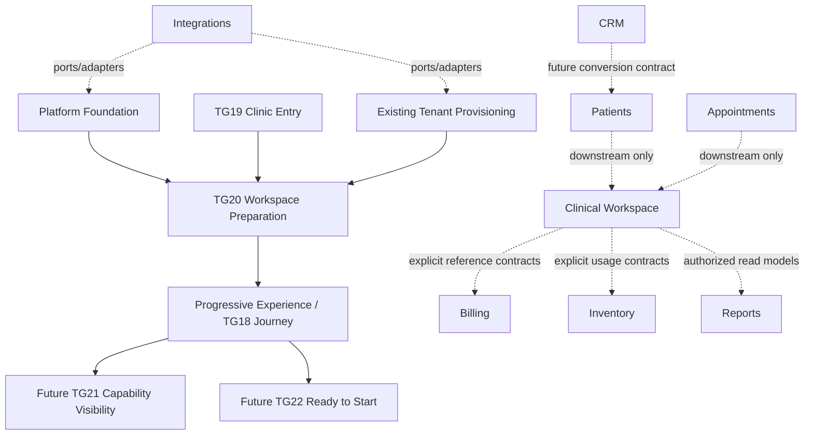
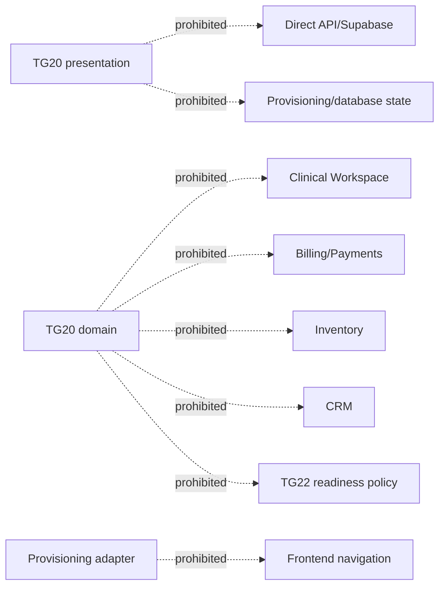

# TG20 Dependency Map

Status: **Architecture planning**

## Allowed dependencies

TG20's only product dependencies are the accepted Platform Foundation, TG19
handoff, existing provisioning boundary, existing onboarding repository/UI
infrastructure, and TG18 Journey handoff. Clinical and business modules shown
below the break are product-map context, not TG20 dependencies.

## Dependency matrix

| Module | May TG20 depend on it? | May it depend on TG20? | Contract |
|---|---|---|---|
| Platform Foundation | Yes, mandatory | No product dependency | Auth, organization, effective tenant, audit, idempotency, UoW, errors. |
| Tenant Provisioning | Yes, through adapter/status evidence | May publish execution evidence | No provider/job internals in TG20 projection. |
| Progressive Experience / Journey | Yes, existing UI/navigation primitives | Yes, consumes handoff availability | Separate preparation vs journey progress. |
| Appointments | No | No | Clinical/operational downstream; out of scope. |
| Patients | No | No | Clinical downstream; out of scope. |
| Clinical Workspace | No | May require prepared workspace later | No TG20 clinical behavior. |
| Billing | No | No direct dependency | Future/reference boundary only. |
| Inventory | No | No direct dependency | Future/reference boundary only. |
| CRM | No | No | Future product area. |
| Reports/Analytics | No write dependency | May consume safe approved events later | No TG20 analytics platform. |
| Integrations | Only through existing provisioning/application ports | No direct UI dependency | Adapters do not own policy. |

## Prohibited dependencies

- TG20 cannot query clinical, appointment, patient, billing, inventory, CRM, or
  reporting tables.
- Those modules cannot mutate preparation state directly.
- Integrations publish evidence through an application port; they do not select
  next actions or navigation.
- TG20 cannot treat capability seed completion as TG21 visibility or readiness.
- No module bypasses Platform Foundation to establish tenant context.

## Reuse decisions

| Reuse | Extend | Do not reuse as TG20 authority |
|---|---|---|
| Platform Foundation context, organization audit/idempotency/UoW | Existing onboarding repository/datasource and query keys | Tenant/application status alone as preparation lifecycle |
| TenantProvisioningService execution boundary | Safe provisioning status adapter | Frontend timers/loading percentage |
| TG18 progress/status/card primitives | Onboarding navigation/handoff | Clinical dashboards or Doctor Module components |
| TG19 tenant-switch/session cleanup | Localization/error token catalogs | Billing/inventory/reporting repositories |

## References

This dependency map is governed by the Nova Product Architecture module graph,
Platform Foundation Architecture invariants, Phase 2 roadmap E3/TG20, TG19
accepted handoff, and ADR-PF-004/005/006/011/015.
