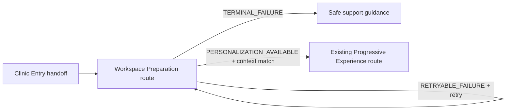
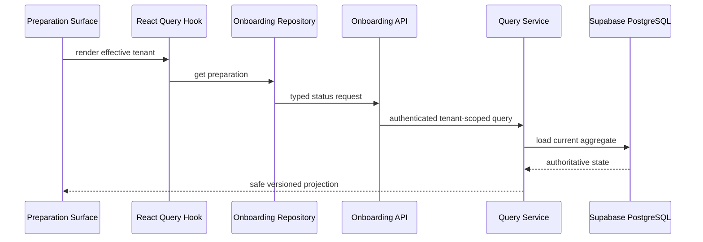

# TG20 Design — Workspace Preparation

> **Controlling operational detail:** `final-authorization-contracts.md`
> freezes the Version 1 read-only onboarding-template resolution, persisted
> execution claim, exact authorization/migration composition, and checkpoint
> boundaries. It controls where this design is less specific.

Status: **Design proposal; no code, API, migration, or UI implementation authorized**

## Design principles

1. Server truth, client guidance.
2. Extend existing onboarding and Platform Foundation seams.
3. One current tenant-scoped preparation run.
4. Explicit version/state handling; unknown means unavailable, never complete.
5. Retry is an application command, not a repeated provisioning call from UI.
6. Personalization availability is not Ready to Start.

## Backend application design

### New application services

`WorkspacePreparationQueryService`

- accepts authenticated actor context and route tenant ID;
- resolves organization membership/effective tenant through Platform Foundation;
- loads the current preparation aggregate;
- returns the Version 1 safe projection;
- never mutates state or creates a synthetic completed record.

`WorkspacePreparationRetryService`

- resolves the same context and locks the current run;
- verifies `RETRYABLE_FAILURE` and retry eligibility;
- consumes existing organization-scoped idempotency;
- requests re-execution through the existing provisioning boundary/adapter;
- appends organization audit and commits atomically;
- returns replay or the new authoritative projection.

### New repository port

`IWorkspacePreparationRepository` requires only:

- `get_current(organization_id, tenant_id)`;
- `get_current_for_update(organization_id, tenant_id)`;
- `add(preparation)`;
- `record_transition(preparation)` through aggregate persistence semantics.

The adapter flushes and does not commit. It must use database uniqueness/locking
to guarantee one current run per organization-tenant-contract lineage.

### Existing services to reuse or extend

| Existing asset | TG20 use |
|---|---|
| `TenantProvisioningService` | Remains executor/owner of tenant provisioning; expose safe completion/failure evidence through an adapter, not direct UI access. |
| `AuthenticatedOrganizationContextService` / effective-tenant service | Authorize organization, association, and tenant equality. |
| Organization idempotency service/repository | Scope retry key and fingerprint. |
| Organization audit repository | Append safe status/retry events. |
| SQLAlchemy UoW | Own transition/audit commit and rollback. |
| Typed error transport pattern | Map stable TG20 failures without raw exception leakage. |

## Backend transport contract

Planning contract only; exact routes follow existing onboarding router conventions:

### Status query

`GET /api/v1/onboarding/{tenant_id}/workspace-preparation`

Response fields:

| Field | Meaning |
|---|---|
| `contract_version` | `workspace_preparation_v1`. |
| `run_id` | Opaque current-run identity. |
| `tenant_id` | Authorized effective tenant. |
| `state` | Version 1 state enum. |
| `progress` | `{completed, total}` or explicit indeterminate form. |
| `units` | Ordered safe unit keys/statuses; optional when indeterminate. |
| `reason_code` | Safe localized classification, never raw text. |
| `retry_allowed` | Server-owned eligibility. |
| `next_action` | `WAIT`, `REFRESH`, `RETRY`, `CONTACT_SUPPORT`, or `ENTER_PERSONALIZATION`. |
| `refresh_after_seconds` | Bounded server hint or null. |
| `updated_at` | Authoritative timestamp. |

### Retry command

`POST /api/v1/onboarding/{tenant_id}/workspace-preparation/retry`

- requires `Idempotency-Key`;
- body carries only current opaque `run_id` and `contract_version`;
- returns the same projection;
- rejects stale run, mismatched tenant, ineligible state, and conflicting replay.

### Typed error categories

- `workspace_preparation.validation`
- `workspace_preparation.unauthorized`
- `workspace_preparation.tenant_mismatch`
- `workspace_preparation.not_found`
- `workspace_preparation.unsupported_version`
- `workspace_preparation.stale_run`
- `workspace_preparation.retry_not_allowed`
- `workspace_preparation.idempotency_conflict`
- `workspace_preparation.retryable_failure`
- `workspace_preparation.terminal_failure`

## Frontend contracts

### Domain

- `WorkspacePreparationState`
- `WorkspacePreparationProgress`
- `WorkspacePreparationUnit`
- `WorkspacePreparationProjection`
- safe typed error mapping
- pure `buildWorkspacePreparationViewModel` projection

The view model maps server state to localization keys, semantics, visible action,
and navigation eligibility. It does not compute preparation truth.

### Data

Extend the existing onboarding repository interface/implementation and
`onboarding.api.ts` with query/retry operations. Use central query keys scoped by
user, organization, tenant, and contract version. Do not create a TG20 API
client, repository layer, or store.

### Presentation and orchestration

Add a Workspace Preparation surface within the existing onboarding navigation
boundary and a focused orchestration hook that:

- validates effective tenant;
- executes the React Query status query;
- honors bounded server refresh hints;
- rejects older request generations/run IDs;
- issues an idempotent retry only on explicit user action;
- refetches context before `ENTER_PERSONALIZATION` navigation;
- reuses TG19 tenant-switch/logout cleanup.

Reuse existing progress, notice, loading, error, button, Journey Card, icon,
Theme, localization, and navigation primitives where the reuse audit proves
contract fit. No inline/hardcoded visual values or visible strings.

## Navigation

Back navigation must not expose a stale Clinic Entry mutation. Deep links to the
preparation route still require authenticated organization/effective-tenant
resolution. Direct deep links to personalization do not bypass eligibility.

## Validation ownership

| Layer | Validation |
|---|---|
| Frontend presentation | Required opaque run for retry, disabled/action state, no authority decisions. |
| Transport schema | UUID/enum/version/header shape and bounded values. |
| Application/domain | Organization/tenant scope, current run, transition, retry eligibility, idempotency intent. |
| Database | Referential integrity, one-current-run constraint, transition concurrency/version column. |

## Data flow

## Persistence planning

The approved architecture requires durable authoritative state, run identity,
retry lineage, and concurrency control not represented by tenant/application
status. Implementation planning must authorize an additive PostgreSQL model and
migration only after confirming the final schema against current migration head.
No existing status column may be repurposed without evidence and an ADR/design
revision.

## Error and recovery behavior

- Network/query failures preserve the last projection only as visibly stale and
  non-navigable.
- Unknown version/state clears actions and provides localized unavailable
  guidance.
- Retryable failure exposes retry only when `retry_allowed=true`.
- Terminal failure exposes safe support guidance and correlation reference when
  available.
- Retry response must match current tenant/run generation before application.
- Logout/tenant switch cancels and removes cached preparation data.

## Localization, Theme, accessibility

Every state, unit, action, announcement, reason, and support message requires
matching `en-US` and `hi-IN` keys. Progress uses `progressbar` semantics when
determinate and a labeled busy/indeterminate semantic otherwise. State changes
announce meaning without repeated polling noise. Actionable failure moves focus
to the error heading/action. Central Theme and existing icon system supply all
visual treatment.

## References

This design consumes Product Architecture, Platform Foundation Architecture,
Phase 2 E3/TG20, TG19 accepted handoff, TG18 Journey Card contracts, and
ADR-PF-004/005/006/011/015/017.
