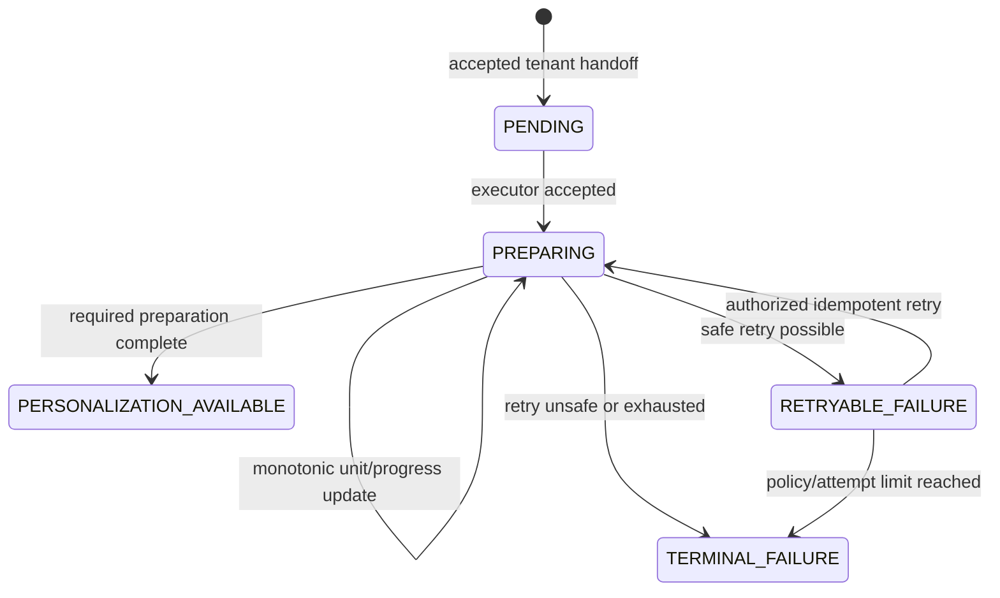

# TG20 Domain Model — Workspace Preparation

Status: **Proposed domain contract**

## Bounded context

Workspace Preparation belongs to Progressive Experience. It observes execution
owned behind the provisioning boundary and exposes product-safe state. It does
not absorb Tenant Provisioning, Platform Foundation, Journey, Capability,
Readiness, or Clinical Workspace contexts.

## Aggregate

### WorkspacePreparation

Aggregate identity: opaque `run_id`.

Scope identity: `organization_id`, `tenant_id`, `contract_version`.

Owned fields:

- state;
- optimistic/concurrency version;
- current attempt and retry count;
- ordered safe preparation units/progress;
- safe reason classification;
- retry eligibility;
- created/started/updated/completed timestamps;
- last idempotent retry operation reference;
- execution correlation reference suitable for internal audit (not raw payload).

Invariants:

1. Organization and tenant are immutable for a run.
2. One current Version 1 run exists per active organization-tenant association.
3. Progress never exceeds total and never decreases within an attempt.
4. `PERSONALIZATION_AVAILABLE` and `TERMINAL_FAILURE` are terminal.
5. Only `RETRYABLE_FAILURE` may transition back to `PREPARING`.
6. Retry increments attempt exactly once per idempotent operation.
7. A stale aggregate version cannot overwrite a newer transition.
8. Reasons and units use safe codes, not infrastructure/provider text.

## Value objects

| Value object | Responsibility |
|---|---|
| `PreparationContractVersion` | Independent additive contract identity; Version 1 is `workspace_preparation_v1`. |
| `PreparationProgress` | Determinate completed/total or explicit indeterminate state. |
| `PreparationUnit` | Ordered safe unit key, state, and timestamps owned by aggregate. |
| `PreparationReason` | Stable safe reason category mapped to localization. |
| `PreparationNextAction` | Backend-authorized `WAIT`, `REFRESH`, `RETRY`, `CONTACT_SUPPORT`, or `ENTER_PERSONALIZATION`. |
| `PreparationAttempt` | Attempt number and timestamps; no provider secrets/details. |

## State machine

Invalid transitions return typed domain failures and do not write audit or
partial state. Duplicate transition messages replay/no-op according to event
identity and aggregate version.

## Domain events

- `WorkspacePreparationQueued`
- `WorkspacePreparationStarted`
- `WorkspacePreparationProgressed`
- `WorkspacePreparationRetryRequested`
- `WorkspacePreparationRetryStarted`
- `WorkspacePreparationAvailableForPersonalization`
- `WorkspacePreparationFailedRetryably`
- `WorkspacePreparationFailedTerminally`

Events contain safe IDs/codes/timestamps only. They may drive projections or
execution adapters but cannot bypass the aggregate transition method.

## Ownership boundaries

| Concept | Owner | TG20 relationship |
|---|---|---|
| Organization/member/effective tenant | Platform Foundation | Referenced and authorized; never mutated as TG20 state. |
| Tenant provisioning tasks | Existing provisioning boundary | Executor evidence translated by an adapter. |
| Journey/card/progress | TG18 Journey Foundation | Downstream consumer/handoff; not preparation state. |
| Capability visibility | TG21 | Future consumer; not a unit-eligibility rule in TG20. |
| Ready to Start | TG22 | Separate readiness aggregate/policy; never equivalent to personalization availability. |
| Clinical entities | Clinical bounded contexts | Entirely out of TG20 scope. |

## Repository ownership

`IWorkspacePreparationRepository` is new because no existing repository owns
this aggregate. Tenant, application, onboarding-status, Journey, idempotency,
and audit repositories remain unchanged in ownership and are reused only through
their existing contracts.

## Compatibility and evolution

Contract version is independent of Journey version and Wizard Draft schema
version. Version 1 clients fail safe for unsupported versions/states. Additive
safe fields may be ignored; changed state meaning requires a new version.
Legacy tenants without a preparation run are not inferred complete: the query
service returns typed not-found/unavailable behavior until an approved
initialization policy creates authoritative state.

## References

Product Architecture defines context ownership. Platform Foundation Architecture
defines organization, effective tenant, audit, idempotency, and transaction
invariants. Phase 2 E3/TG20 defines the product outcome. ADR-PF-004/005/006/011
constrain scope, retry, transactions, and handoff.
