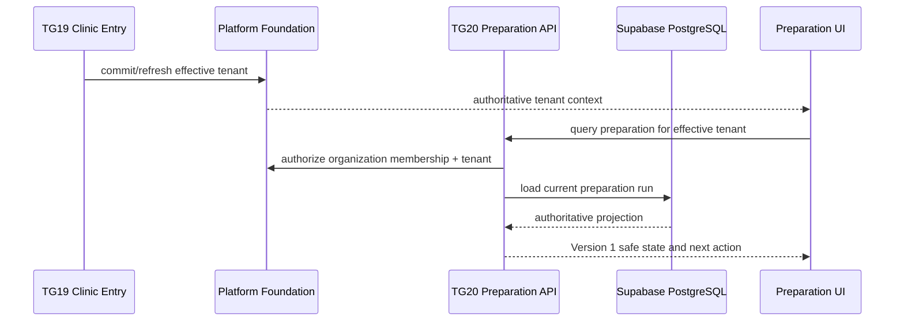
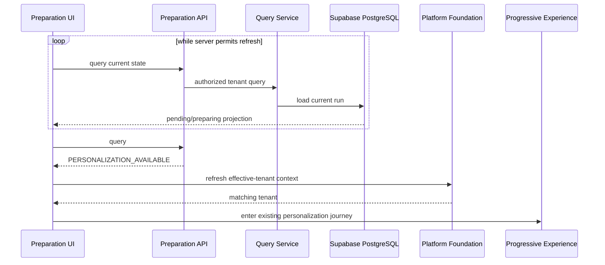
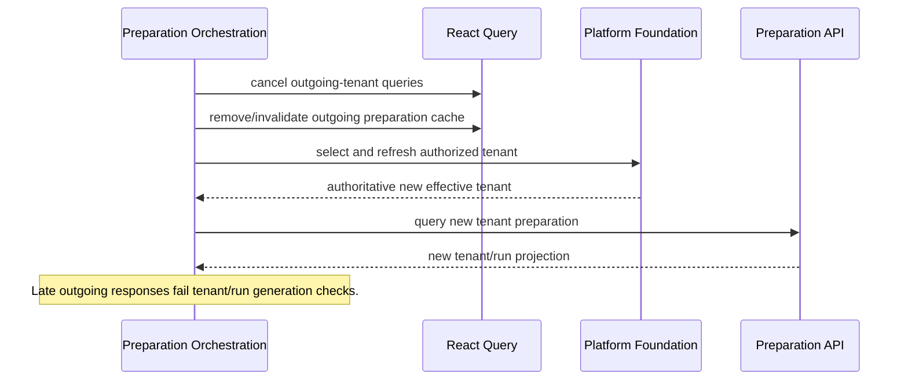
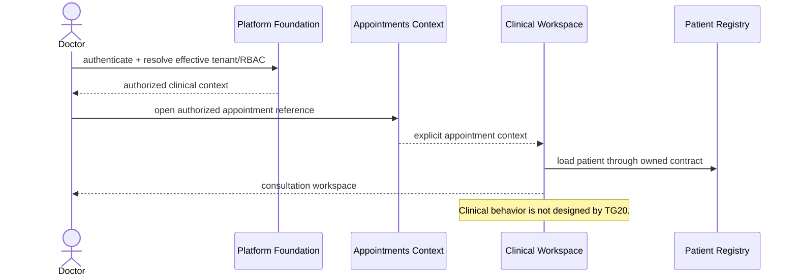
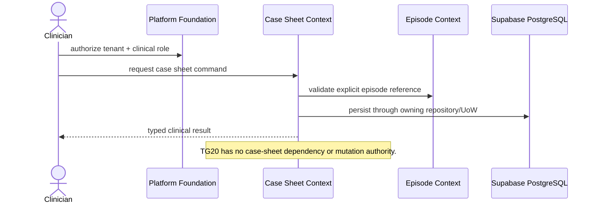
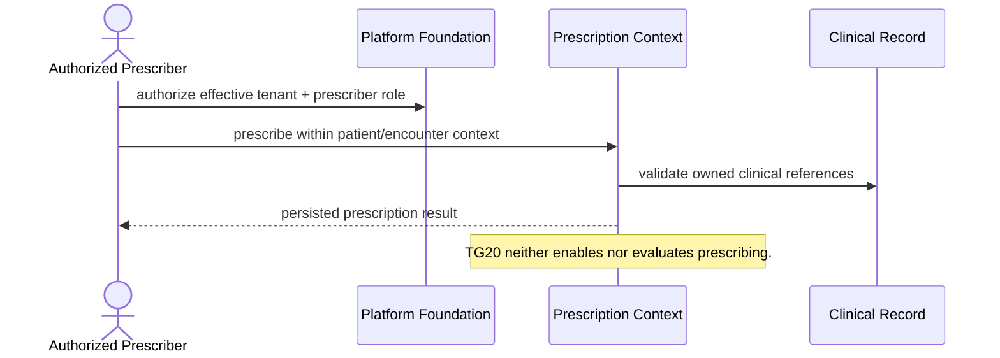
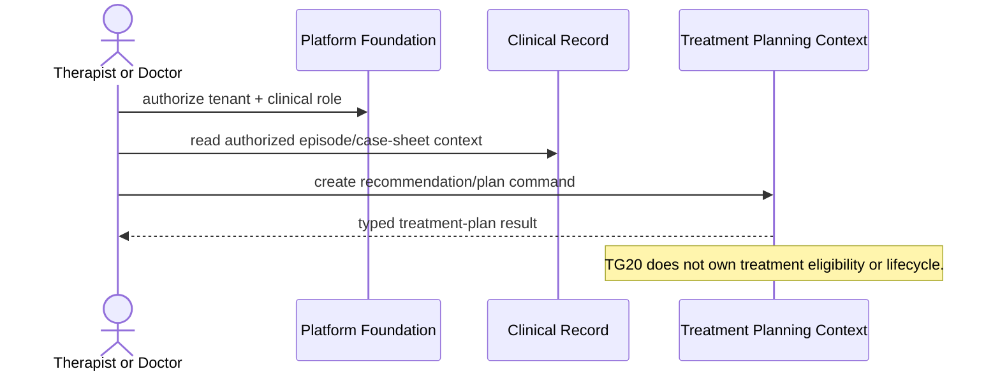
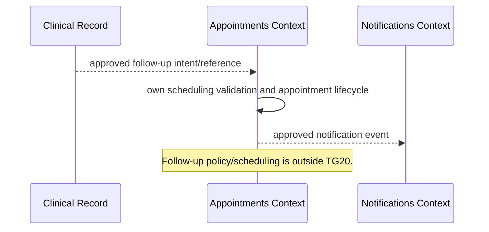
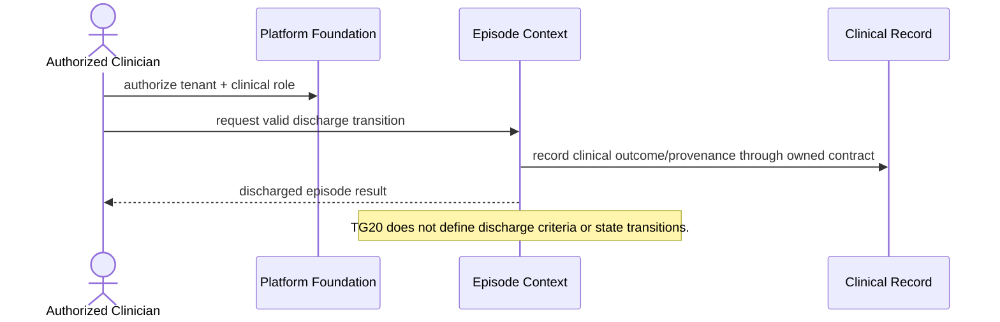

# TG20 Sequence Diagrams

Status: **Architecture planning**

## Scope warning

The Phase 2 roadmap defines TG20 as Workspace Preparation and explicitly excludes
Doctor Module, Clinical Workspace, scheduling, inventory, billing, payments, and
clinical workflow changes. The clinically named sequences requested for this
package are therefore documented as **downstream boundary sequences**, not TG20
behavior or implementation authorization.

## 1. TG19 handoff to Workspace Preparation



## 2. Preparation progress and personalization handoff



## 3. Retryable failure

```mermaid
sequenceDiagram
    actor U as Organization Administrator
    participant UI as Preparation UI
    participant API as Retry API
    participant S as Retry Service
    participant ID as Organization Idempotency
    participant P as Provisioning Adapter
    participant AUD as Organization Audit
    participant UOW as Unit of Work
    U->>UI: retry current run
    UI->>API: run ID + Idempotency-Key
    API->>S: authenticated retry command
    S->>ID: begin scoped operation/fingerprint
    S->>S: lock run; verify RETRYABLE_FAILURE
    S->>P: request approved re-execution
    S->>AUD: append safe retry event
    S->>UOW: commit transition + audit
    S-->>UI: authoritative PREPARING/replay projection
```

## 4. Tenant switch during preparation



## Downstream clinical boundary diagrams

Each sequence begins only after TG20 returns
`PERSONALIZATION_AVAILABLE`. TG20 does not own or implement any named clinical
step. The diagrams show permitted context consumption and aggregate ownership.

## 5. Doctor consultation — OUT OF SCOPE



## 6. Case sheet creation — OUT OF SCOPE



## 7. Prescription — OUT OF SCOPE



## 8. Treatment recommendation — OUT OF SCOPE



## 9. Billing — OUT OF SCOPE

```mermaid
sequenceDiagram
    participant OP as Approved Operational/Clinical Event
    participant B as Billing Context
    participant PF as Platform Foundation
    participant DB as Supabase PostgreSQL
    OP-->>B: explicit billable reference/event
    B->>PF: authorize tenant + financial action
    B->>DB: persist invoice through financial repository/UoW
    B-->>OP: financial reference/status only
    Note over B: Billing never mutates clinical truth; TG20 never triggers billing.
```

## 10. Follow-up — OUT OF SCOPE



## 11. Discharge — OUT OF SCOPE



## References

The Product Architecture owns downstream module boundaries. Platform Foundation
owns identity/tenant/security context. The Phase 2 roadmap owns TG20 scope. These
diagrams must not be used as clinical implementation requirements.
